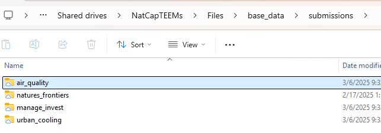

# Contributing to Devstack's Base Data

Our base data is becoming a valuable asset that accelerates our shared work. Towards that, this page documents how **you** could contribute (if you want) your project's data so that it works seamlessly with the rest of the devstack. When done correctly, our base_data has two useful aspects:

1.  Files are automatically downloaded by the get_path() function.
2.  All rasters are Pyramidal Cloud Optimized Geotiffs (POGs), which enables, among many other things
    1.  The ability to download a subset of a single raster
    2.  The ability to use precise and very fast zonal statistics
    3.  Very accurate area-per-cell calculations (without imprecision from using projected data)

## What is unique about open data

To make one's project fully replicable, it obviously needs to have an open git repo for the **code**. The challenge, though, is that git is not good for managing **data**, so if someone clones your code, it will probably fail because it doesn't (and shouldn't if the data is \> 5MB) include the data in the repo. The way our Devstack manages base_data is that it is automatically downloaded via p.get_path() when it is needed. Thus, if you want your project to "just work", we need to figure out how to create a good system for proposing new contributions to the base data and then cleaning/curating them so they work well. 

## How to contribute your input data

The above only works if your data is included in our base_data in the proper location and in the proper format. Here we discuss how you can contribute it into the base data so your code works for everyone else (in the lab, and optionally for the general public).

1.  Move your data into our TEEMs drive in the base_data submissions folder in a single folder with your project's name. See the example below for the full base_data location and a few example projects.

2.  Change your git repo so that that ALL (ABSOLUTELY ALL) data are referenced via a relative path into this submissions base_data folder. So, for instance, if you had a file "emissions_factors.csv" in the air_quality project, the code would reference it as

`data_ref_path = os.path.join("submissions", "air_quality", "emissions_factors.csv"`

The `data_ref_path` is what we call a Reference Path (or Ref Path), which `get_path(data_ref_path)` can find and download; the canonical definition, including the full order of directories `get_path` searches, is in [Conventions](conventions.qmd#get_path-and-ref_path).

3.  Put a Readme.md in your submission folder. It should reference the code used to produce it and basic information on units, interpretation, and how it should be used.
4.  After you complete 1-3, email me! I will then test your repo and code by cloning the repo, modifying ONLY the base_data_dir, and then check that everything runs.
5.  I will then further clean the data (to be compliant with the conventions defined here <https://justinandrewjohnson.com/earth_economy_devstack/conventions.html>, and specifically, to be a [POG](pogs.qmd). I'm happy to do the cleaning, but if you want, you might want to consider following the conventions earlier in your project rather than later. 
6.  I'll write "unittests" that ensure your code and data work, which will be automatically run when there's a new release of the devstack repo.
7.  If everything passes, the data get "promoted" to base_data by eliminating the word "submissions" in their file path (e.g., `base_data\submissions\emissions_factors.csv` becomes `base_data\emissions_factors.csv`)

If all these edits are done, you can now change your code to use the Reference Path and it will work for you and for everybody else too.