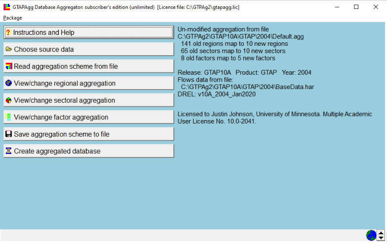
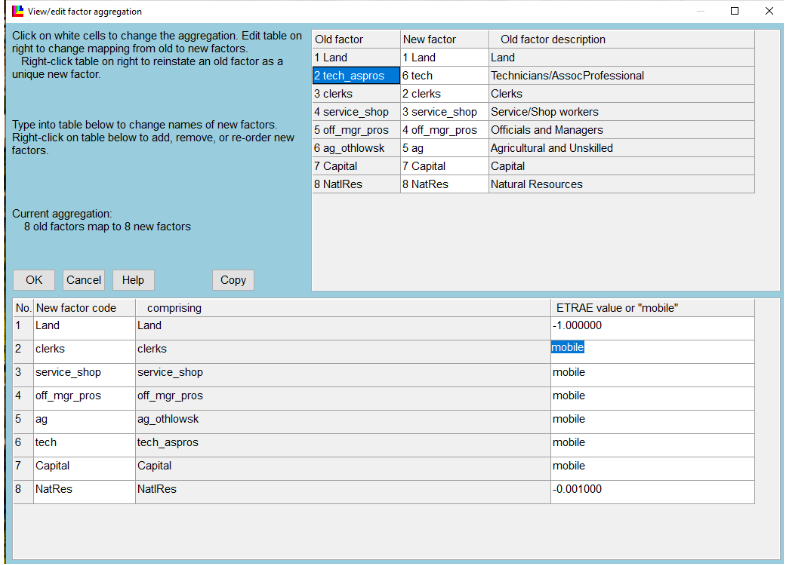
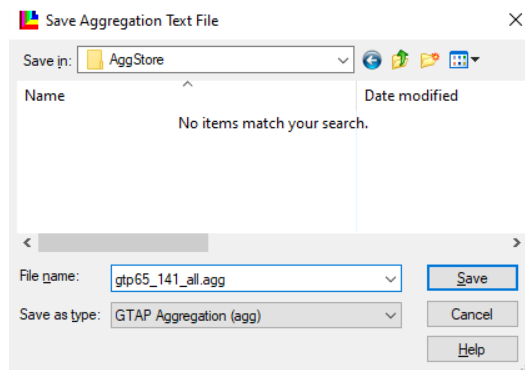
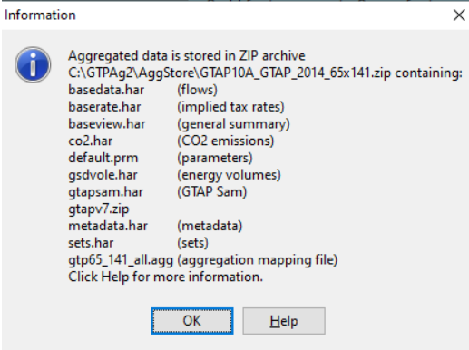

# Building an aggregated database with GTAPAgg2

The GTAP database ships fully disaggregated — in GTAP 10A, 141 regions × 65 sectors × 8 endowments. Almost nothing is run at that resolution. GTAPAgg2 is the tool that collapses it to whatever regional, sectoral and factor aggregation a study needs, and the aggregated database it emits is what GTAPpy runs against.

The aggregation is named, versioned and treated as an input, following the `v11-s26-r50` style described in [Conventions](conventions.qmd): database version, sector count, region count. GTAPpy iterates over a list of these, so producing them is a prerequisite rather than a one-off.

This page walks through producing the *fully disaggregated* (1:1) case, because it is the one that trips people up — it is the same procedure as any other aggregation, just with an identity mapping. Any real aggregation is the same clicks with a different scheme.

## The GTAPAgg2 main menu

Everything happens from one window. The right-hand panel always reports what is currently loaded — release, product, data year, the source `.agg` file, and the current mapping counts — so it is the first thing to read when something looks wrong:



The panel above reads "141 old regions map to 10 new regions, 65 old sectors map to 10 new sectors, 8 old factors map to 5 new factors" — that is the shipped `Default.agg`, a 10×10 aggregation. It is a useful thing to run first, because it solves in seconds, but it is not what we want here.

Note the source path it reports (`...\GTAP10A\GTAP\2004\Default.agg`) — the product is plain `GTAP` and the year is 2004. If you want AEZ land detail or a more recent base year, fix that under **Choose source data** before touching the mapping.

## Setting a 1:1 mapping

Work down the menu:

**View/change regional aggregation** and **View/change sectoral aggregation** — set both to 1:1, so all 141 regions map to 141 new regions and all 65 sectors to 65 new sectors.

**View/change factor aggregation** — this one does *not* default to the identity. It arrives as 8 endowments mapped to 5, so it has to be set to 8:8 explicitly:



The right-hand column is the part that matters economically. `ETRAE` is the elasticity of transformation between uses: a finite negative value makes a factor sluggish (Land at −1.0, NatlRes at −0.001, i.e. nearly fixed in place), while `mobile` makes it perfectly mobile across sectors. Here everything except Land and Natural Resources is set mobile — the labour categories, capital, and `tech_aspros` are all free to move.

::: callout-note
## AEZ land and factor aggregation

When using the AEZ product, land is specified separately for each agro-ecological zone, which interacts awkwardly with factor aggregation. As of these notes that was an open issue Erwin was working on, and the workaround was to fall back to the standard (non-AEZ) GTAP package for the 1:1 build. Check the current state of the AEZ package before assuming this still applies.
:::

An alternative to all of the above is **Read aggregation scheme from file**, which loads a `.agg` you already have — the shipped `Default.agg` is the 10×10 one described above.

## Saving the scheme

**Save aggregation scheme to file** writes the `.agg` into `AggStore`. Name it for what it is, not for the project that first needed it:



The `.agg` file is plain text. Once you have seen one, the fastest way to produce a systematic family of aggregations is to write them with a text editor (or from Python) rather than clicking through the GUI each time — which is how the aggregations GTAPpy iterates over are actually maintained.

## Creating the database

**Create aggregated database** does the work and reports what it produced:



The output is a zip in `AggStore` named for the aggregation — here `GTAP10A_GTAP_2014_65x141.zip` — containing the pieces the model reads:

| file | contents |
|---------------------------|---------------------------------------------|
| `basedata.har` | the flows database |
| `baserate.har` | implied tax rates |
| `baseview.har` | general summary |
| `default.prm` | behavioural parameters (elasticities) |
| `sets.har` | set definitions |
| `co2.har`, `gsdvole.har`, `gtapsam.har` | emissions, energy volumes, SAM |
| `metadata.har` | metadata |
| `gtp65_141_all.agg` | the aggregation mapping used to build it |
| `gtapv7.zip` | **the v7-format version of the same database** |

That last entry is the one to pay attention to. GTAPAgg2 emits the database in two formats: one for the GTAP v6.2 model code and one for v7.0, the latter nested inside `gtapv7.zip`. **GTAPpy uses v7.** Extracting the outer zip and pointing at its contents is a standard mistake that produces a database the v7 model will not read.

So the aggregated database you want ends up somewhere like:

``` text
C:\GTPAg2\AggStore\GTAP10A_GTAP_2014_65x141\gtapv7
```

That directory is what gets copied into a model version directory in [Running GTAP by hand](gtappy_rungtap.qmd), and what a GTAPpy run file points at as its data directory for that aggregation label.