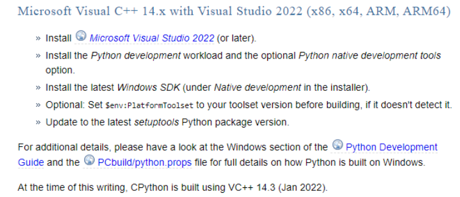
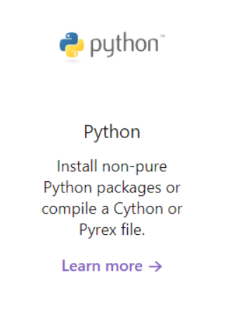
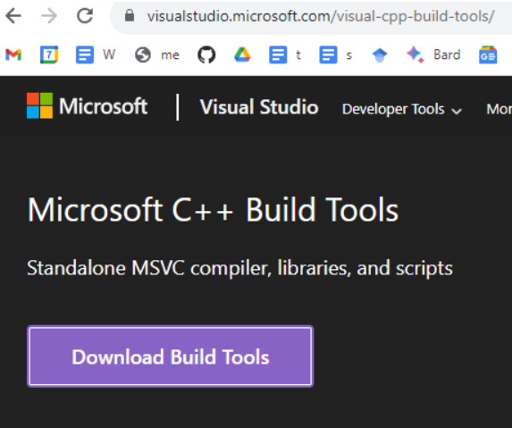
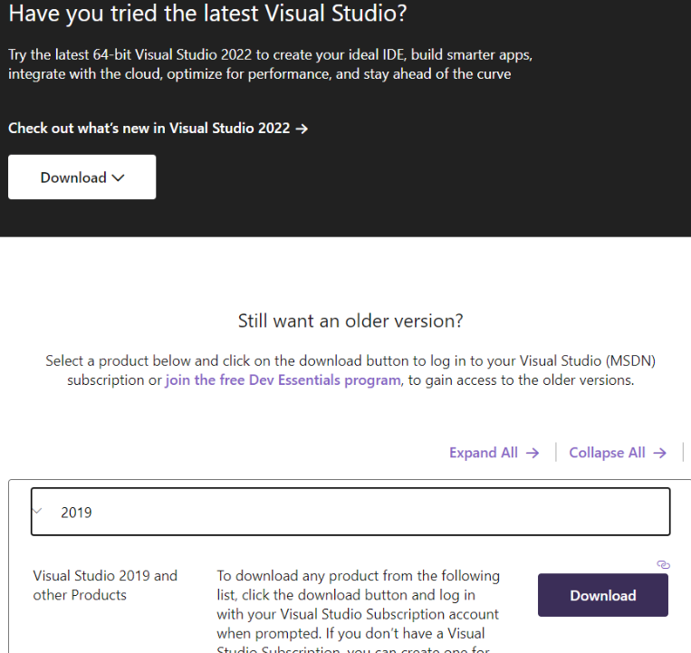
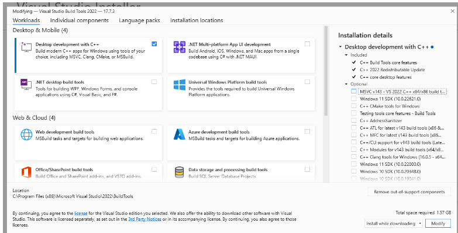
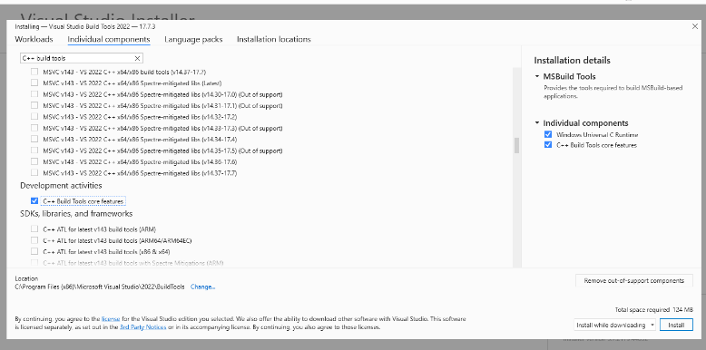
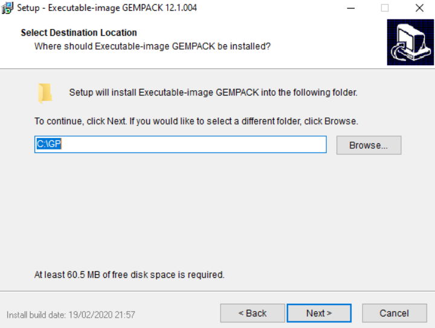
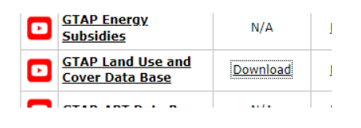
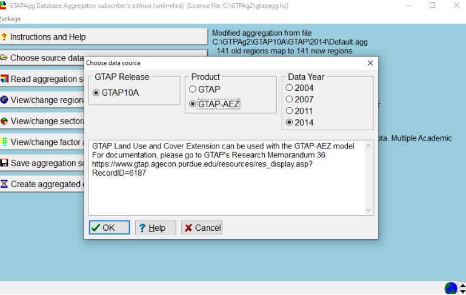

# Installing the GTAP toolchain

GTAPPy is a thin Python layer over a stack of Windows programs from Purdue and
CoPS. Installing GTAPPy itself is the easy part; the work is getting that stack
in place and licensed. There are four pieces, and they have to be installed in
roughly this order:

| piece | what it is | why you need it |
|-------|------------|-----------------|
| Microsoft C++ Build Tools | MSVC compiler | builds the Cython extensions in Hazelbean, which GTAPPy imports |
| GEMPACK (`gpei`) | the CGE solver | actually solves the GTAP model |
| RunGTAP | GUI front end | ships the compiled v7 model code and is how you produce a working version directory |
| GTAPAgg2 | database aggregator | turns the licensed GTAP database into the aggregation you want to run |

GEMPACK, RunGTAP and GTAPAgg2 are Windows-only. On a Mac or Linux workstation
the usual arrangement is a Windows VM holding the toolchain, driven over SSH —
`gtappy_runner.py` has a `run_gtap_cmf_on_vm` path and a `mac_to_win` path
translator for exactly this.

## 1. C++ build tools (for Cython)

This step is not about GTAP at all. Hazelbean, which GTAPPy depends on, contains
Cython extension modules, and `pip` has to compile them on install. On Windows
that requires the MSVC compiler, and the error you get without it ("Microsoft
Visual C++ 14.0 or greater is required") is the most common first-run failure in
the whole devstack.

The Python packaging documentation's
[Windows compilers](https://wiki.python.org/moin/WindowsCompilers) page is the
authority on which compiler version pairs with which Python. It is worth
checking rather than guessing, because the requirement moves with each CPython
release:



The same page is where the "you only need this if you are compiling a Cython or
Pyrex file" caveat comes from — which is precisely our case:



You do not need full Visual Studio. The standalone
[Build Tools for Visual Studio](https://visualstudio.microsoft.com/visual-cpp-build-tools/)
package is enough, and is a much smaller install:



If the current build tools do not match the compiler version your Python needs,
older releases are reachable from the same site under "Still want an older
version?", though this requires a (free) Dev Essentials account:



In the installer, the simple route is the **Desktop development with C++**
workload, which pulls in the compiler, the CRT and the Windows SDK together:



If you would rather keep the install small, skip the workload and pick the
components directly on the **Individual components** tab — the MSVC v143 x64/x86
build tools, the C++ build tools core features, the Windows Universal C Runtime,
and a Windows SDK. That is roughly 100 MB more rather than the workload's
several GB:



Verify by opening a fresh shell and importing Hazelbean, which triggers
compilation on first import:

``` python
import hazelbean as hb
```

## 2. GEMPACK

GEMPACK is the solver. Download the executable-image release from CoPS at
<https://www.copsmodels.com/gpeidl.htm> — for example
`gpei-12.1.004-install.exe` (or the 12.0 build if you need to match an older
model release).

Install to the default location. GEMPACK expects to live at a short path with no
spaces, and a lot of downstream configuration assumes `C:\GP`:



Proceed **without** selecting a licence file. That starts the six-month trial,
which is enough to get a working setup before a licence is sorted out.

The path you install to is the one GTAPPy needs to know about; in a run file it
is set as the GEMPACK utilities directory (historically `p.gempack_utils_dir`).

## 3. RunGTAP

Install RunGTAP from
<https://www.gtap.agecon.purdue.edu/products/rungtap/default.asp>.

RunGTAP is a GUI, and GTAPPy exists so you do not have to use it for production
runs. You still need it installed, for two reasons: it ships with a compiled
copy of the GTAP v7 model code, which is where the version directory GTAPPy runs
against ultimately comes from; and it is the most convenient place to sanity-check
a new database or a new shock before wiring it into a task tree. Both of those
are covered in [Running GTAP by hand](gtappy_rungtap.qmd).

## 4. GTAPAgg2 and the GTAP database

::: {.callout-important}
## This step needs a GTAP database licence

Everything below requires access to the GTAP database, which is licensed from
Purdue. Within our group you can instead reach an already-licensed copy through
the `ee_internal` database — use `hb.get_path()` against the private bucket
rather than downloading and aggregating yourself. The manual route is documented
here because someone has to do it once per database release, and because it
explains where the files GTAPPy consumes come from.
:::

**Get GTAPAgg2** from <https://www.gtap.agecon.purdue.edu/private/secured.asp?Sec_ID=1055>.

**Get the licence file.** Step 2 of
<https://www.gtap.agecon.purdue.edu/databases/download.asp> yields a `.lic` file.
Put it in the `GTAPAgg2` directory — the aggregator reads it from there and the
title bar shows the licence it found.

**Get the database itself**, from the same download page. Take the standard
package *and* the AEZ (Land Use and Cover) version — the AEZ extension is what
carries land by agro-ecological zone, which is the whole point of the
land-use work the devstack does with GTAP:



Each download is a `.pkg` file; put both in the `GTAPAgg2` directory. When you
launch GTAPAgg2, point it at both packages so the AEZ product is selectable
under **Choose source data**. Getting this wrong is a quiet failure — you get a
perfectly valid database that simply has no AEZ detail in it:



With the toolchain installed, continue to
[Building an aggregated database](gtap_aggregation.qmd).
