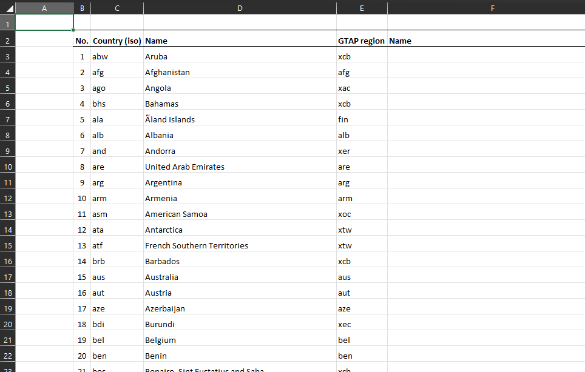
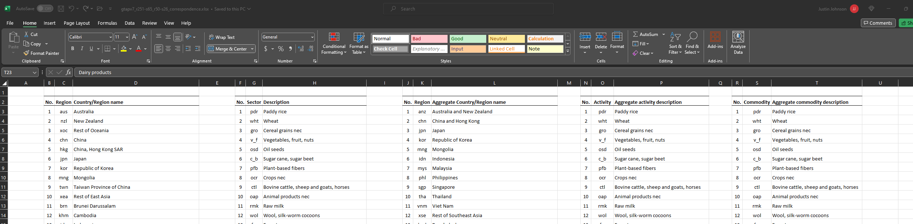
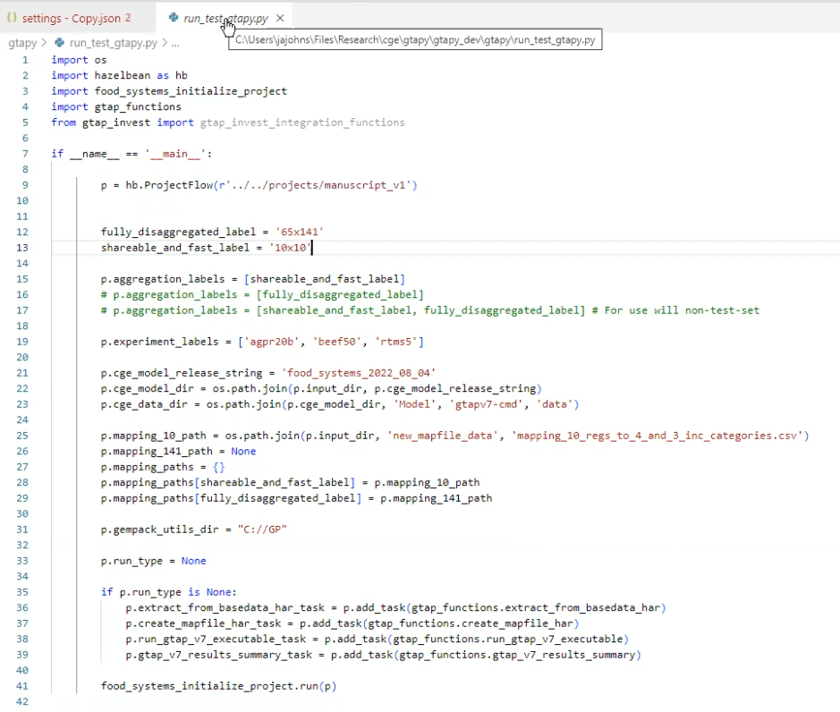
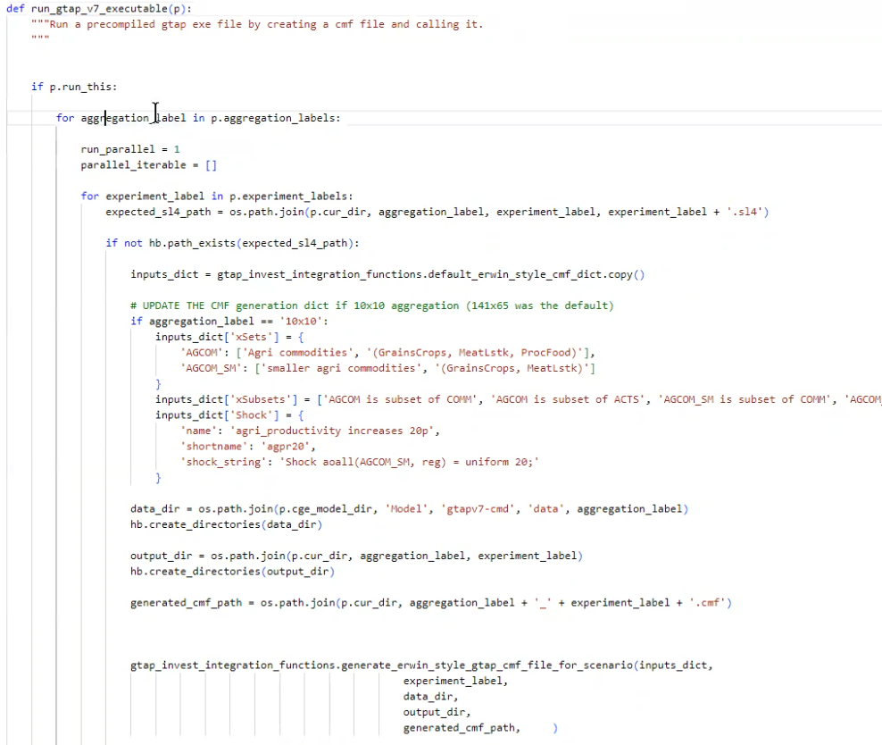

# GTAPpy development notes

::: {.callout-note appearance="simple"}
## Historical record, not a guide

These are dated notes from the 2022–2023 build-out of GTAPpy, kept because they
record *why* several conventions are the way they are and what was still open at
the time. The code shown has since moved to the `run_project(p)` run-file
convention described in [Conventions](conventions.qmd), so do not copy from it.
For current usage start at [GTAPpy](gtappy.qmd).
:::

## v2023-12-18 — correspondence files into EE spec

The open question this entry records: how to get from an Erwin-style mapping
workbook to the [EE spec](conventions.qmd) correspondence format.

This is what a region correspondence looks like as it arrives:



Two problems with it as a machine-readable input. First, the file has to be
renamed to say what it actually maps — `gtapv7_r251_r160_correspondence.xlsx`
(and it has to stay `.xlsx` rather than CSV, because the mapping spans multiple
worksheets). Second, `No.` is used twice in the same sheet, once numbering the
r160 regions and once the r251 ones. Any parser reading it positionally gets
this wrong, so the input format needs to disambiguate the two.

Legend information is also carried inside the region correspondence sheet, which
is the wrong home for it — it needs a deliberate place of its own rather than
being attached to whichever correspondence happened to need it.

The same pattern applies to sectors, which is the converted, EE-spec shape:



A terminology note worth preserving: "sector" is used here specifically for the
case where you are *not* distinguishing `COMM` (commodities) from `ACTS`
(activities) — at the time these notes were written the distinction had not been
pinned down.

## v2023-12-15 — conventions settled with Erwin

Proposals raised against the model release layout, and how they resolved.

**Naming.**

1. In the release's `Data` folder, the aggregation label `gtapaez11-50` should
   be `v11-s26-r50` — database version, sector count, region count.
2. The most recent release carries **no** timestamp; dated versions of a
   same-named model or aggregation take the timestamp of when they were first
   released.
3. CMF files renamed from `cwon_bau.cmf` to `gtapv7-aez-rd_bau.cmf`, and
   `cwon_bau-es.cmf` to `gtapv7-aez-rd_bau-es.cmf` — hyphens join parts of one
   variable, underscores split the name into its list of fields.
5. `SIMRUN` becomes just the experiment name (`bau`) rather than project name
   plus experiment.

**Project structure.**

4. Drop `set PROJ=cwon` from the CMF — the project is defined by the ProjectFlow
   object, not the command file.
6. Separate data and output from the code release:

   ``` text
   set MODd=..\mod      set CMFd=.\cmf
   set SOLd=..\out      set DATd=..\data%AGG%
   ```

   `SOLd` and `DATd` deliberately live *outside* the release.

7. The goal is that a release can be run either by calling the batch file or by
   calling the Python run script, so the two are kept as close as possible. The
   asymmetry is intentional and one-directional: the batch file can only
   reproduce a resource-depletion run without ecosystem services, so the Python
   script can wrap the batch file but not the reverse.
8. CMF command-line options renamed to match what they are:
   `gtap_base_data_dir`, `starting_data_file_path`, `output_dir`,
   `starting_year`, `ending_year` (previously positional `p1`–`p5`).
   `experiment_label` may not be renameable, as it appears to be fixed by the
   CMF filename.

**Answers from Erwin.**

9. *Can the raw GEMPACK output be read to estimate progress, for a progress bar?*
   Yes, when running with automatic accuracy — GEMPACK reports its position:

   ``` text
   +++> Beginning subinterval number 4.
   ---> Beginning pass number 1 of 2-pass calculation, subinterval 4.
   Beginning pass number 6 of 6-pass calculation, subinterval 6
   ```

10. *Could years drop the `Y` prefix (`Y2018`), which breaks string→int
    conversion?* No — keep the `Y`. GEMPACK variable names cannot begin with a
    non-numeric... that is, cannot begin with a numeral.

11. *There is no `bau-SUM_Y2050`, though there is for `VOL` and `WEL` — is that
    intentional?* No: `SUM` describes the *starting* database, so a terminal-year
    SUM is meaningless. Relatedly, welfare cannot be produced in a
    resource-depletion run because there is no discount rate.

12. *Is everything stored in the `.sl4`, making the other files redundant?* No.
    Conversions such as results in volume terms are not in the `.sl4` and have to
    come from `sltoht` or `ViewSOL`.

## v2023-11-01 — first working shocks

Shocks implemented at this point: population file replacement, GDP change, and
(tentatively) yield changes.

The run file of the era created the ProjectFlow object at the top and added
tasks to it — the ancestor of today's task tree:



Note the shape already visible here: a list of aggregation labels
(`'10x10'`, `'65x141'`) and a list of experiment labels (`'agpr20b'`, `'beef50'`,
`'rtms5'`), iterated over as a cross product. That is the multi-aggregation
philosophy described on the [GTAPpy home page](gtappy.qmd), present from the
start.

And the task that generated a CMF and called the executable:



The interesting part is the `if not hb.path_exists(expected_sl4_path)` guard —
skip-if-already-computed, done by hand before it was pushed down into
ProjectFlow — and the per-aggregation override of `xSets`, `xSubsets` and
`Shock`, since the 10×10 aggregation needs different set members than the
141×65 default.

**What was hard.** The open problem at this date was making shocks work
generally: producing `xSets`, `xSubsets` and `Shock` statements per scenario,
with `READFROMFILE` in the TABLO CMF as the mechanism for file-driven values.
The taxonomy that came out of it is on
[Running GTAP by hand](gtappy_rungtap.qmd#kinds-of-shocks).

A distinction from this entry worth restating, because it caused confusion:
there are **shocks** and there are **data updates**, and replacing an elasticity
file is the latter. If you swap in `basedata2` with a matching `default2.prm` and
apply no shock, the model reproduces that database — the elasticities are, in
that sense, calibrated to it. A supply-response elasticity behaves differently
and will move the results.

Population shocks needed one more preprocessing step: the value has to be a
percentage change over the default `POP` in the base data, so an external
population file is read in and processed against the base rather than used
directly.
