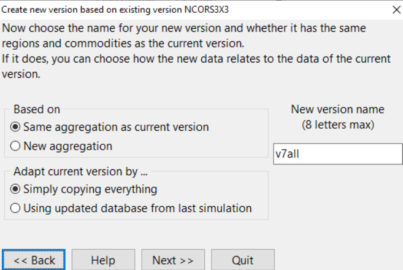
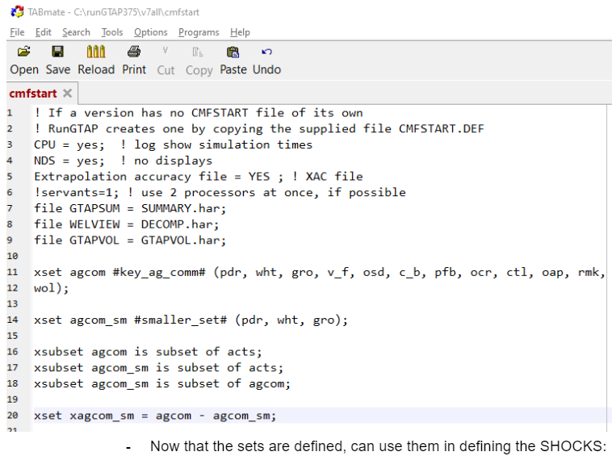
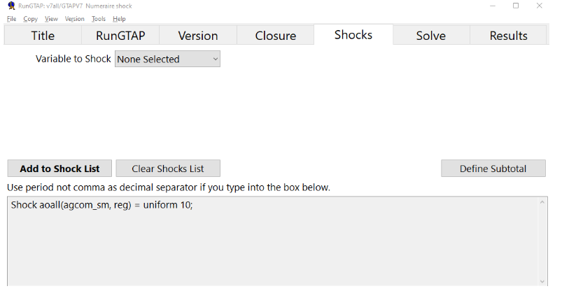

# Running GTAP by hand

GTAPPy generates CMF files and calls GEMPACK so you do not have to do this
manually. It is still worth doing once. The manual route is where the model
version directory comes from in the first place, it is the fastest way to check
that a new database or a new shock is sane before wiring it into a task tree,
and when a GTAPPy run fails it fails at one of the steps below.

## Getting a v7 version directory

RunGTAP organises work into *versions* — a directory holding model code, data,
shock files and experiment definitions. What we want is a v7 version containing
our own aggregated database rather than the toy one RunGTAP ships with. The
quickest way to get one is, somewhat inelegantly, to have RunGTAP build it and
then swap the data underneath:

1. Under **Version → Change**, select `NCORS3x3` — the shipped 3×3 v7 version.
2. Under **Version → New**, run the wizard with **Same aggregation as current
   version** and **Simply copying everything**, naming the result `v7all`
   (RunGTAP version names are capped at 8 characters):

   

3. This creates `c:\runGTAP375\v7all`. Now replace the data files in it with the
   fully disaggregated database produced in
   [Building an aggregated database](gtap_aggregation.qmd) — the contents of
   the `gtapv7` directory, not the outer zip.

### Rebuilding the shock files

The new version also inherits `.shk` files from the 3×3 original (`tinc.shk` and
friends). Those are dimensioned for the old aggregation and are wrong for the
database you just dropped in.

**Tools → Run Test Simulation** rewrites them to match the current aggregation.
This is also the full end-to-end test that the version works at all — if the
database, sets and model code are inconsistent, this is where you find out.

To confirm it worked, look at **Results → Macros**, or open the solution in
`ViewSOL` via **View → Results Using ViewSOL**. The distinction matters:
RunGTAP's own results view shows only the subset of variables in its mapping,
whereas `ViewSOL` loads the whole `.sl4` file. Checking `pgdp` is a quick tell —
under the default test shock, prices come out up about 10%. From `ViewSOL`,
**File → open in ViewHAR** gives more still, including dimensional sorting.

## Defining sets

A non-trivial shock usually needs sets the base model does not define — you
rarely want to shock all commodities, you want to shock the agricultural ones.

Sets live in the `CMFSTART` file, which is the version's runtime configuration:
it sets solver options and names the files to use, and it is where the closure's
sets get defined. Reach it through **RunGTAP → View → Sets**, enable advanced
editing, then **Sets → View Set Library**.

Clicking `COMM` and copying its elements in TABLO format gives you the full
commodity set as text, which you then pare down to the ones you want:



The pattern in that file is worth reading carefully, because it is exactly what
GTAPPy emits programmatically:

``` text
xset agcom #key_ag_comm# (pdr, wht, gro, v_f, osd, c_b, pfb, ocr, ctl, oap, rmk, wol);
xset agcom_sm #smaller_set# (pdr, wht, gro);

xsubset agcom is subset of acts;
xsubset agcom_sm is subset of acts;
xsubset agcom_sm is subset of agcom;

xset xagcom_sm = agcom - agcom_sm;
```

Three things are going on. `xset` declares a set by listing its elements.
`xsubset` asserts containment, which GEMPACK checks and which is what lets the
set be used where a subset of `ACTS` or `COMM` is expected — omit these and the
solve fails with a set-mismatch error rather than a helpful message. And the
last line defines the *complement*, `xagcom_sm`, by set subtraction: having the
complement available is what lets you shock one group while holding the rest
fixed, or apply opposite shocks to the two halves.

Here `agcom` is the full agricultural commodity list and `agcom_sm` a
three-element subset used for quick tests.

## Defining and running shocks

With the sets defined, the **Shocks** tab takes shock statements over them:



``` text
Shock aoall(agcom_sm, reg) = uniform 10;
```

Then set the solution method to **Gragg 2-4-6**, save the experiment, and solve.

::: {.callout-tip}
## When the solver will not converge

From Tom: if Gragg does not work, use Euler with many steps — 20 to 50. It is
slower but far more forgiving of a badly behaved database.
:::

### Kinds of shocks

The shock statement above is the simplest of several forms:

**Uniform.** One value applied across the whole set:

``` text
Shock aoall(agcom_sm, reg) = uniform 20;
```

**From file.** Values read per element, which is how any spatially or sectorally
heterogeneous scenario is applied — a yield shock from a SEALS run, a population
path, a GDP trajectory. Zero means no shock, so the file covers the full set:

``` text
Shock pop(REG) = SELECT FROM FILE <filename> HEADER "<4-letter header>";
```

Anything in the exogenous list can be shocked this way.

**Swap.** Exchange an exogenous variable for an endogenous one, which changes
what the model is solving for rather than perturbing it. Swapping `aoreg` with
GDP lets you drive the model with a GDP path and back out the productivity that
implies — the standard move for calibrating to an exogenous growth scenario.

**Parameter replacement — not a shock.** Elasticities live in `gtapparm`, so
changing one means writing a new `.prm` file. This is an input change, not a
perturbation, and the difference has a real consequence: with a new base
database and its matching `.prm` and no shock, the model reproduces that
database exactly. A supply-response elasticity (as in the PNAS work) is the
exception — that one does change the outcome.

## The command-line chain

For production, RunGTAP is replaced by a sequence of batch files. This is the
sequence GTAPPy automates, and the names are worth knowing because they appear
in logs:

1. **`testsim.bat`** — the test simulation, as above, run first.
2. **`rungtapv7.bat`** — the actual simulations.
3. **`simresults.bat`** — post-processing. It takes the `.sl4` solution files,
   converts each to a `.sol` HAR file, combines them into one file, and splits
   that to CSV.

Two levels of aggregation come out of the post-processing: `RMAC` is full
dimension, `RMCA` is aggregated according to the chosen reporting simplification.
`AggMap.har` defines that reporting aggregation; `Allres.cmf` runs it, calling
`allres.tab` to clean the results.

Adding a new scenario therefore means touching more than the shock file:
`allres.tab` needs the new scenario added at the top, and `Allres.EXP` — along
with the per-scenario `.EXP` files — needs the correct exogenous variables listed
(e.g. `tpdall`). Forgetting the `.EXP` side is a common cause of a scenario that
runs but produces nothing in the summary tables.

### Composite tax shocks

One idiom worth recording, from working through import taxes with Erwin. A tax
applied to both domestic and imported goods needs an added equation that makes
the components sum:

``` text
E_tpm (all, c, COMM)(all, r, REG) tmp(c, r) = tpmall + tpreg + tpall;
```

And mind the distinction between shocking a *rate* and shocking a *power*: "the
beef tax rate increases 50%" is not the same statement as "the power of the
tariff increases 50%", and the two give materially different answers.
