# Contributing code to the Earth Economy Devstack

The Earth Economy Devstack and all of its published article code is available as open source software at GitHub, which not only allows users to download and run the code but also to develop it collaboratively. GitHub is based on the free and open source distributed version control system **git** (<https://git-scm.com/).> **git** allows users to track changes in code development, to work on different code branches and to revert changes to previous code versions, if necessary. Workflows using the version control system **git** can vary and there generally is no 'right' or 'wrong' in collaborative software development. We also create and host a curated base_data. This data can be seamlessly downloaded using ProjectFlow within the devstack via the `get_path()` method. See the last section of this page for details on contributing data.

There are two different ways to interact with a github repository:

1.  Branching for internal collaborators. Needs to be a member of the NatCapTEEMs github organization. We use **Git Flow** (a `main` branch for releases plus a `develop` integration branch), documented below.

2.  Forking with pull requests. Works for external collaborators. Anyone can do it!

Below we summarize these two processes.

## 1. Contributing via Branches (internal)

Internal TEEMs members have push access to our repos. The repos themselves are already public, but unless you're on the team, you can only push changes to your GitHub User Account repo (not the main repo). Below we describe the standard command-line method for contributing in this way and then summarize how to do it in VS Code with a UI via GitGraph.

### Command line contribution

1.  Clone main repo. `git clone https://github.com/NatCapTEEMs/global_invest_dev`
2.  Create feature branch: `git checkout -b feature/my-change`
3.  Make changes, commit, push branch to main repo
4.  Open pull request from feature branch to develop
5.  After review/approval, merge and delete feature branch

### VS Code GitGraph based contribution

There are many other graphical user interfaces that help with git commands (so you don't have to memorize all of the commands), including Github Desktop, Sourcetree and others. We also will use a VS Code plug called GitGraph to manage our repository. To install GitGraph, go the the Extensions left tab in VS Code and search for it. Once installed, you will find a button on the status bar to launch it. Using the gtap_invest_dev repository as an example, it should look like this:

#### Using Git Graph to make a change

We use **Git Flow**: a `develop` integration branch separate from `main` (which holds releases). Feature branches are made off `develop` and pull requests target `develop`. Below we document this workflow.

Suppose you want to make a change to the `hazelbean_dev` repository. We will use this example to explain how we use Git Graph to make this contribution. First, let's take a look at the Git Graph interface.

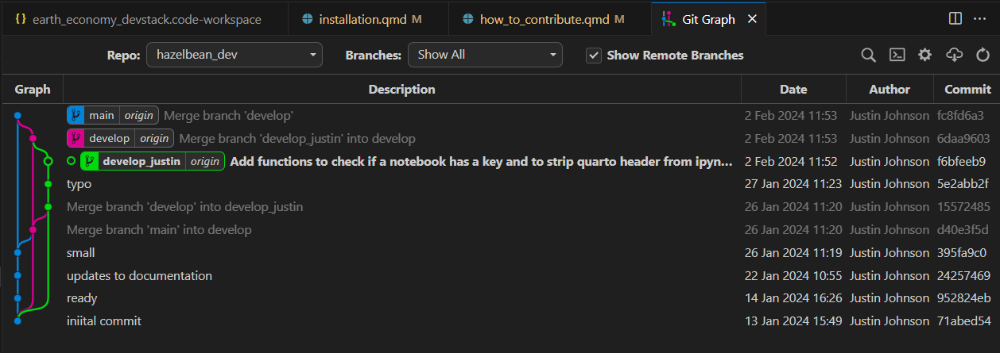

First note the Repo dropdown box indicating we are looking at the hazelbean_dev repo. Here you could switch to other Repos that have been added to your workspace. The next thing to note are the three different branch tages (Blue, Magenta and Green boxes on the Git Graph tree view). These are the three branches that are currently in the hazelbean_dev repository. The blue branch is the `main` branch, the magenta branch is the `develop` branch and the green branch is a branch specific to the user and/or the feature. In this case, it is `develop_justin` branch. The lines and dots indicates the history of how files were edited and then how the different branches were merged back together after an edit. By default, when you clone a repository, you will be on the `main` branch. To switch to another branch, right-click the tag and select `checkout branch`. When you do this, the files on your harddrive will be changed by Git to match the status of the branch you just checked out. In the image below, we can see which is the current branch because it has an open-circle dot in the graph and the name is bold. Other things to notice is that after the name of the branch there is the word `origin`. This indicates that the branch is synced with the remote repository (named origin by convention).

To make a change, you will first want to create your own branch. First, make absolutely certain you currently have checked out the `develop` branch (unless you know why to do otherwise). We will use `main` branch only to contain working "releases". Once `develop` is checked out, use the Command Pallate (`ctrl-shift-p`) and search for `create branch`.

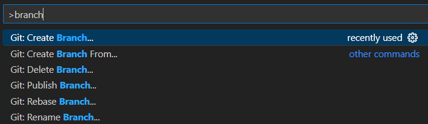

Choose the right repository among those loaded in your workspace, hazelbean_dev in this example.

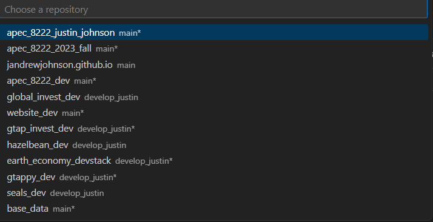

Then select it and give the new branch a name, either `develop_<your_name>` or `feature_<your_feature_name>`. Below we have created a new feature branch called `feature_test` branched off of the `develop` branch. It should look like this

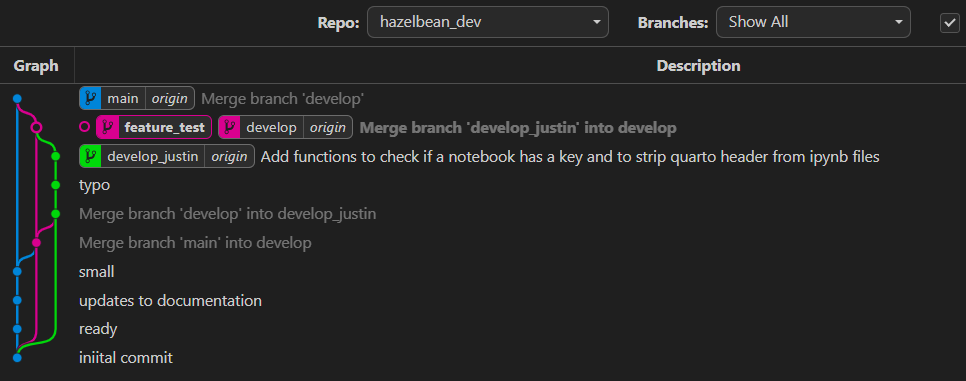

You'll notice that the tag is bold, indicating you have checked it out and it is your current branch. Also notice though that it does not have the tag `origin` after it, indicating that it is not synced with the remote repository. To sync it, you will need to push it to the remote repository. To do this, right-click the tag and select `push branch`. This will push the branch to the remote repository and it will be available to other users.

Another way to push the branch is using the Version Control tab in VS Code. Click the Version Control tab on the Lefthand bar. There you will see all of the repos you have loaded into our workspace. For hazelbean_dev, you will see it has a `publish branch` button. Clicking this will have the same effect as the `push branch` command in Git Graph.

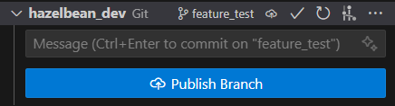

Regardless of how you pushed it to the remote repository, you will now see the branch has the 'origin' tag after it, indicating it is synced with the remote repository. It is now also the checked-out branch and so all changes you make will be made to this branch.

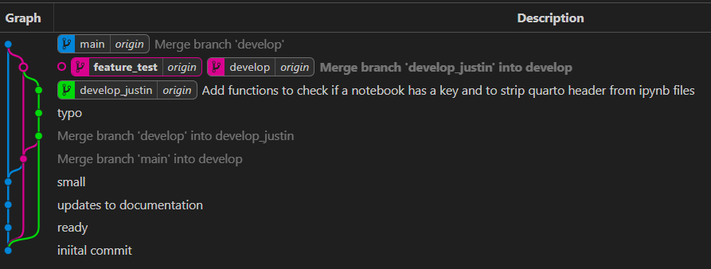

Now, we're going to make a small change to the code. In the VS Code file explorer, I will open up file_io.py in the hazelbean module and scroll to the function I want to edit.

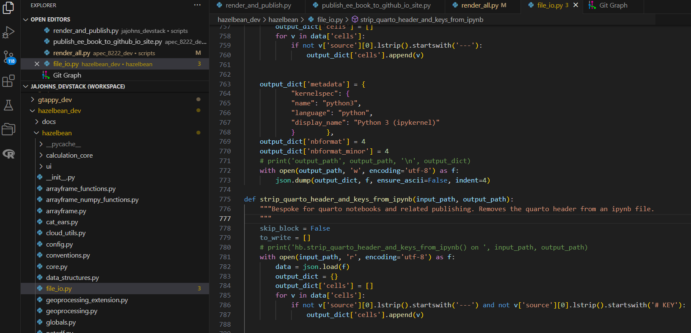

On lines 778-779, you'll see VS Code has greyed the variables out indicating they are not used, so I will remove them. Once gone, you'll see a blue bar on the left side of the editor. This is Git and VS Code indicating to you you made a change. Blue indicates a modification where as green indicates a new addition and red indicates a deletion.

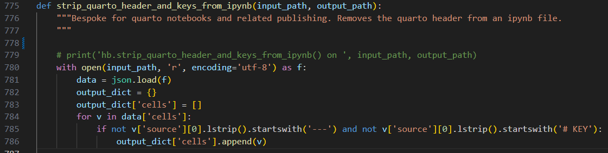

To illustrate a new addition, I will add a line at to space out our for loop. Once I do this, you'll see the green bar on the left side of the editor. In the image you can also see that the file_io.py is now a different color and has an M next to it. This indicates that the file has been modified.

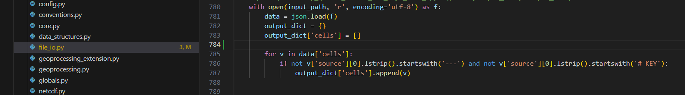

Another useful thing you can do is click on the Blue or Green edit bar to see more details, as below.

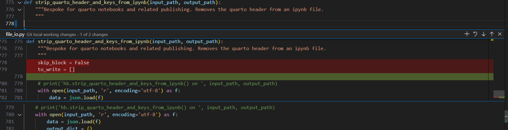

Here, you can see the exact changes you made. Additionally, there are buttons at the top of this new box that let you revert the change to go back to how it was before.

Before we commit our changes, look at the Git Graph view. You'll see that we now have a new grey line coming from the feature_test branch, showing that we have uncommitted changes. You could click on the uncommitted changes link to see the edits we made.

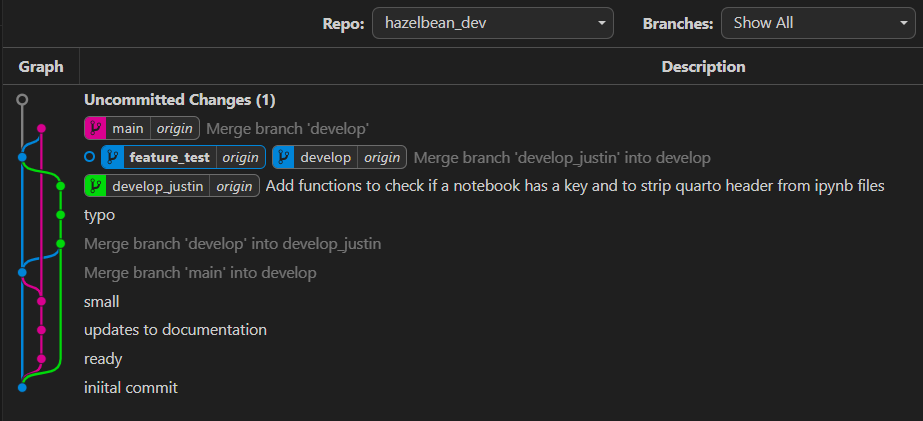

We are now going to commit our changes. To do this, go to the Version Control Tab. You will now see that there is a change listed under the hazelbean_dev repository. Click on the change to see the details. You will see a more detailed "diff editor" that lets you understand (or change) what was edited. To accept these changes, we will click the commit button. But first write a short commit message. Click Commit (but don't yet click the next button to Sync changes). After committing, look back at the Git Graph view. You'll see that the grey line is now gone and the blue feature_test tag is at the top of our commit tree along with our comitt message.

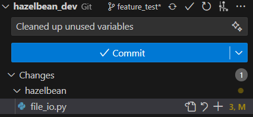

Notice though that the tag for origin/feature_test is not yet up at the new location. This is because we have not yet pushed our changes to the remote repository. To do this, click the Sync button in the bottom right of the VS Code window. This will push your changes to the remote repository and update the tag to the new location, like this.

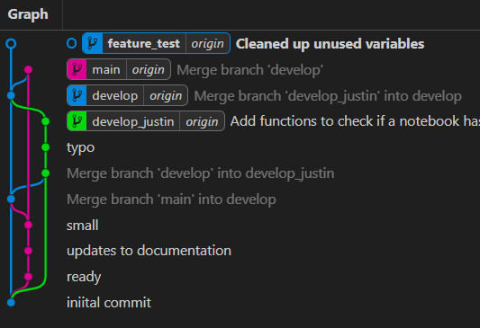

Your code is now on GitHub and other contributors with access could check it out and try it. But, this code will be different than their code and if you made non-trivial changes, it could be hard to keep straight what is going on. To clarify this, we are going to merge our `feature_test` branch back into `develop`.

To do this, first you must make sure you have the most recent version of the `develop` branch. To do this, first we will use the command palette and search for `git pull`. This will pull the most recent changes from the remote repository and update your local `develop` branch. Next, we want to make sure that any changes in `develop` are merged with what we just did to our `feature_test` branch. If there were no changes, this is not strictly necessary, but it's a good precation to take to avoid future merge conflicts. To do this, right click on the `develop` tag and select `merge into current branch`. A popup will ask you to confirm this, which you do want to (with the default options).

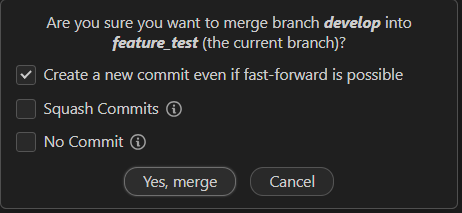

Now that we know for sure we have the most up-to-date develop branch details, we can merge our new feature into the develop branch. However, we will protect the develop branch so that only features that pass unit tests can be merged in. Thus, you will make a pull request, as described above, to get me to merge your work in the develop branch. For completeness, here we discuss how one would to that. To do this, first right-click on the `develop` tag and select `Checkout branch`. Our git tree will now show we have `develop` checked out:

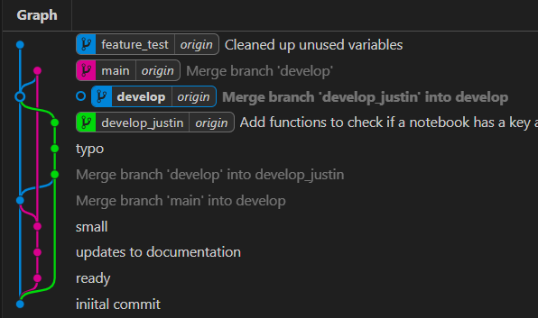

With develop checked out, now right click on `feature_test` and select `merge into current branch`. Select confirm in the popup box. Click Sync Changes in the Version Control Tab.

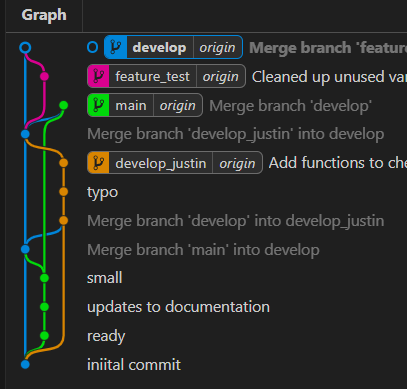

the feature_test and develop branches are now identical. You could now delete feature_test and nothing would be lost. Now, the develop branch is ready for a user to use and/or make new branches off of.

For this feature to become released into the main branch, you must submit a Pull Request (see the section below).

## 2. Contributing via Forking (external)

Using SEALS as an example, this section walks through how a new user could contribute a modification via a fork and pull request.


Before developing the code it is recommended to create a [fork](https://docs.github.com/en/pull-requests/how-tos/work-with-forks/fork-a-repo) of the original SEALS repository. This will create a new code repository at your own GitHub profile, which includes the same code base and visibility settings as the original 'upstream' repository. The fork can now be used for

1.  code development or fixes
2.  submitting a pull request to the original SEALS repository.

#### 1. Clone fork to your local machine

Although GitHub allows for some basic code changes, it is recommended to [clone](https://docs.github.com/en/pull-requests/how-tos/work-with-forks/fork-a-repo) the forked repository at your local machine and do code developments using an integrated development environment (IDE), such as [VS Code](https://code.visualstudio.com/). The figure below illustrates the relationship of the original repo, your own user repo (made by forking) and then the local set of files cloned onto your machine.


To clone the repository on your local machine via the command line, navigate to the local folder, in which you want to clone the repository, and type

```         
git clone -b <name-of-branch>` <url-to-github-repo> <name-of-local-clone-folder>
```

For example, if you want to clone the develop branch of your SEALS fork type

```         
git clone -b develop https://github.com/<username>/seals seals_develop
```

Before making any changes, make sure that your fork and/or your local repository are up-to-date with the original SEALS repository. To pull changes from your fork use `git pull origin <name-of-branch>`. In order to pull the latest changes from the original SEALS repository you can set up a link to the original upstream repository with the command `git remote add upstream https://github.com/jandrewjohnson/seals`. To pull the latest changes from the develop branch in the original upstream repository use `git pull upstream develop`.

During code development, any changes or fixes that should go back to the fork and/or the original SEALS repository need to be ['staged'](https://docs.github.com/en/get-started/exploring-projects-on-github/contributing-to-a-project) and then ['commited'](https://docs.github.com/en/get-started/exploring-projects-on-github/contributing-to-a-project) with a commit message that succinctly describes the changes. By staging changes, **git** is informed that these changes should become part of the next 'commit', which essentially takes a snapshot of all staged changes thus far.

To stage all changes in the current repository use the command `git add .`. If you only want to stage changes in a certain file use `git add <(relative)-path-to-file-in-repo>`.

To commit all staged changes use the command `git commit -m "a short description of the code changes"`.

After committing the changes, they can be pushed to your fork by using `git push origin <name-of-branch>`, illustrated in the bottom two rows of the figure below. Eventually, your code can be incorporated back into the upstream repository via pull requests, discussed below.

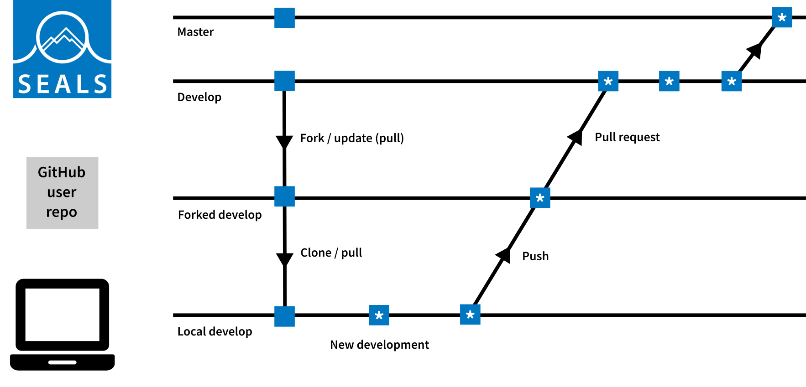

#### Updating Your Fork with Changes from the Original Repository

It often happens that after you forked a repo, someone else makes a change that you need and you would like to update your fork with the latest changes from the original repository, This is easy if you haven't made any changes, and just a bit harder if you have. To do so, follow these steps:

**1. Configure the Original Repository as a Remote**

If you haven't already, add the original repository as a remote. You typically name it `upstream`.

``` sh
git remote add upstream <URL of the original repository>
```

**2. Fetch the Latest Changes from the Original Repository**

Fetch the branches and their respective commits from the `upstream` repository. Commits to `main` will be stored in the local branch `upstream/main`.

``` sh
git fetch upstream
```

**3. Merge (or Rebase) the Changes**

1.  Switch to your local `main` branch (or the branch you want to update).

    ``` sh
    git checkout main
    ```

2.  Merge the changes from `upstream/main` into your local `main` branch.

    ``` sh
    git merge upstream/main
    ```

3.  Resolve any merge conflicts if they arise, commit the merge, and push the updated branch to your fork.

    ``` sh
    git push origin main
    ```

**4. Ensure Your Fork is Up-to-Date**

If you have other branches, you may need to repeat the merge or rebase process for each branch.

**Summary of Commands**

``` sh
git remote add upstream <URL of the original repository>
git fetch upstream
git checkout main
git merge upstream/main  # or git rebase upstream/main
git push origin main  # use --force with rebase
```

By following these steps, you will incorporate the latest changes from the original repository into your fork.

# Pull Requests

Regardless of if your contributing via branches or teams, we will use Pull Requests to incorporate your changes into the main branch.

In order to propose changes to the original SEALS repository, it is recommended to use [pull requests](https://docs.github.com/en/pull-requests/how-tos/create-pull-requests/creating-a-pull-request-from-a-fork). Pull requests inform other users about your code changes and allow them to review these changes by comparing and highlighting the parts of the code that have have been altered. They also highlight potential [merge conflicts](https://docs.github.com/en/pull-requests/reference/merge-conflicts), which occur when git is trying to merge branches with competing commits within the same parts of the code. Pull requests can be done directly at GitHub by navigating to either the forked repository or the original SEALS repository and by clicking on 'Pull requests' and then 'New pull request'. This will open a new pull request page where changes can be described in more detail and code reviewers can be specified. Pull requests should be reviewed by at least one of the main code developers.

Here is an example where you think some functions in `seals_process_coarse_timeseries.py` within the `seals` project should be removed and relocated to a project-specific repository, rather than remaining in the core `seals` repository. In your **forked** `seals` repository:

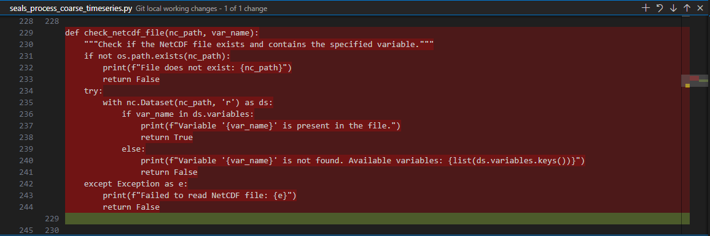

This example shows that you have made changes in `seals_process_coarse_timeseries.py`. You need to "Stage Changes" (as indicated by the red circle) and "Commit Changes" before you can create a pull request.

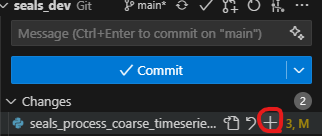

Next, `commit and sync` the changes to the forked repository.

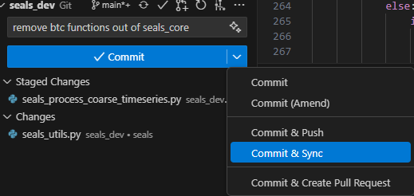

To create a pull request, please go to your forked repository on GitHub.

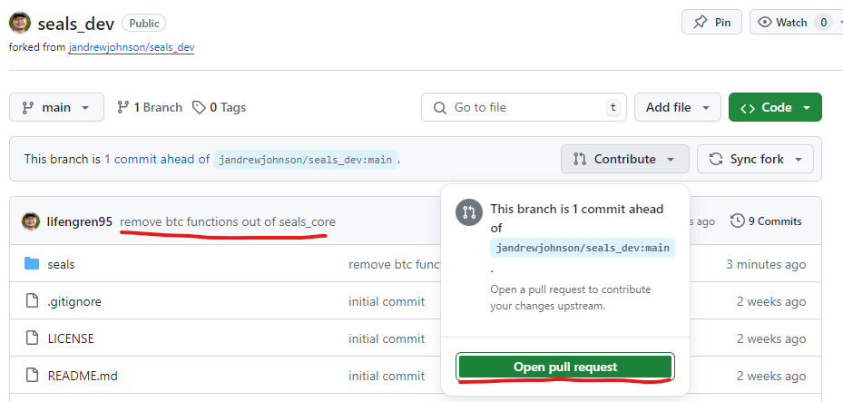

You will see your commit message should match the information you typed in the commit box when you committed and synced the changes. Then, click on the `Contribute` button and select `Open pull request`.

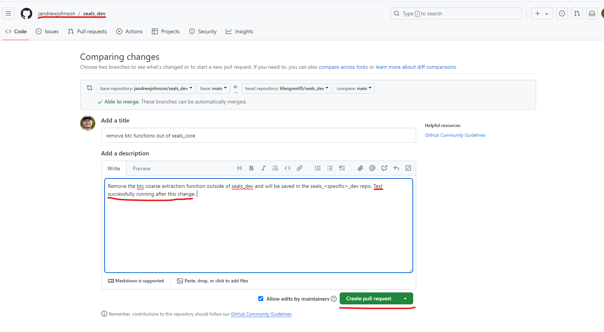

On the pull request page, which appears on the `upstream` repository, you can add more information about the changes you made. Before clicking on the `Create pull request` button, **test your changes again** and ensure they pass all tests before proceeding to ensure that the changes work as expected.

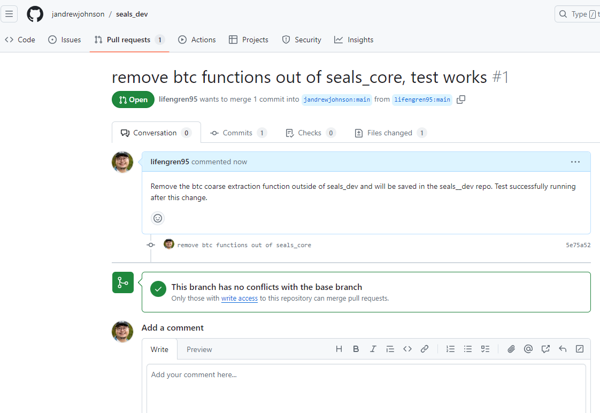

Finally, the pull request will appear in the `upstream` repository. The main developers will review your changes and, if approved, will merge them into the `upstream` repository.

#