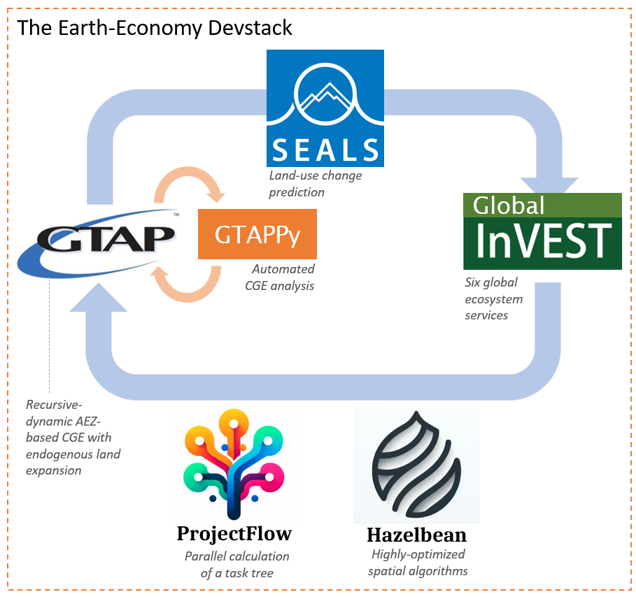

# Earth-Economy Devstack

This is the documentation for the Earth-Economy Devstack, which is the set of repositories and code tools used by [NatCap TEEMs](https://natcapteems.umn.edu/). This documentation starts with installation instructions, overall organization of the Earth-Economy Devstack and discusses common coding practices used among the multiple related repositories. See my [YouTube channel](https://www.youtube.com/@justinandrewjohnson) or specifically the most up-to-date [Earth-Economy Devstack Training playlist](https://www.youtube.com/playlist?list=PLir2vw2cQ_Nu8RWoNfH_-QUmxKnK4Bztf).

## SEALS and GTAP-InVEST are documented elsewhere

SEALS and GTAP-InVEST are part of the Earth-Economy Devstack, but because they are
also standalone models with their own user guides, their documentation is not in
this sidebar. It lives under each model's own home page:

- [SEALS](https://justinandrewjohnson.com/seals/) — home page, [user guide](https://justinandrewjohnson.com/seals/user_guide/), and [GitHub](https://github.com/jandrewjohnson/seals)
- [GTAP-InVEST](https://justinandrewjohnson.com/gtap_invest/) — home page, [user guide](https://justinandrewjohnson.com/gtap_invest/user_guide/), and [GitHub](https://github.com/jandrewjohnson/gtap_invest)

The pages that remain here — Hazelbean, GTAPPy, Base Data, and the Code Standards
section — cover the shared libraries, data and conventions that all of the models build on.

Most of my Youtube playlists are publicly available but unlisted, so to access the rest of my videos, see the following links:

- Previous version of my Big Data class. [APEC 8222, Spring 2023](https://www.youtube.com/playlist?list=PLir2vw2cQ_NsgumvBeIq_Cy9QrXsGHUKK)

- A [comprehensive](https://www.youtube.com/playlist?list=PLir2vw2cQ_NsE6dLL7KDjav0WayF6cB1E) list of videos without any editing/cutting. Only useful if you want to hear inane babbling from me when I'm waiting for something to download or are really interested in what I do after class when I forget to turn off the zoom recording...