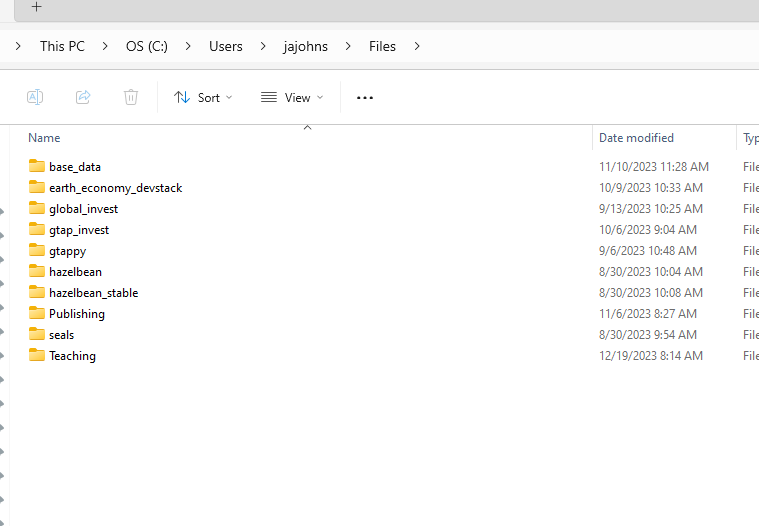
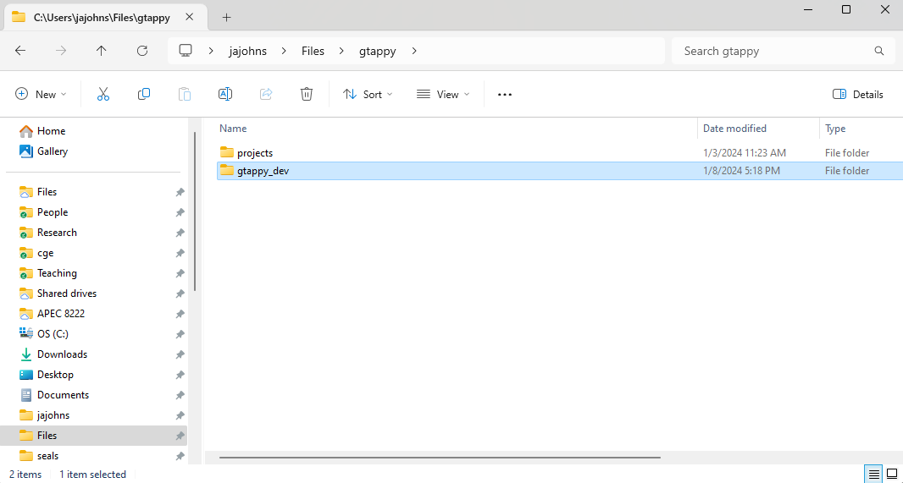
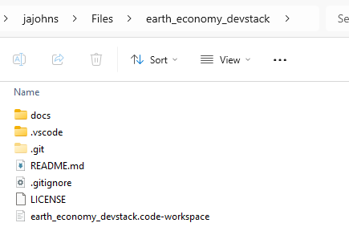
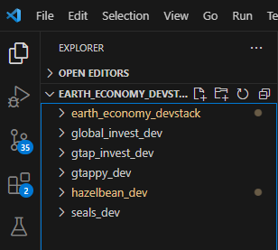
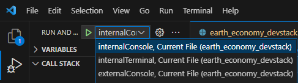

# Organization

## Getting the earth_economy_devstack repository

Assuming you have already setup your python environment and installed VS Code, the first step is to clone all of the relevant repositories into the exact-right location. Throughout this documentation, we refer to "EE Spec", or Earth-Economy Specification. This is simply the common conventions for things like naming files and organizing them so that it works for all participants; the full set is written up on the [Conventions](conventions.qmd) page. The EE Spec organization is to clone the `earth_economy_devstack` repository, available at <https://github.com/jandrewjohnson/earth_economy_devstack>, into your Users directory in a subdirectory called Files. The PC version is shown below.

To clone here, you can use the command line, navigate to the Files directory and use `git clone https://github.com/jandrewjohnson/earth_economy_devstack` . Alternatively you could use VS Code's Command Pallate \<ctrl-shift-s\> Git Clone command and navigate to this repo. This repository configures VS Code to work well with the other EE repos and, for instance, defines launch-configurations that will always use the latest from github.

## Get the other repositories

Next, create a folder for each of the five core repositories in the Files directory, as in the picture above.

1.  hazelbean
2.  seals
3.  gtappy
4.  gtap_invest
5.  global_invest

Inside each of these folders, you will clone the corresponding repositories:

1.  <https://github.com/jandrewjohnson/hazelbean_dev>
2.  <https://github.com/jandrewjohnson/seals>
3.  <https://github.com/jandrewjohnson/gtappy_dev>
4.  <https://github.com/jandrewjohnson/gtap_invest_dev>
5.  <https://github.com/NatCapTEEMs/global_invest_dev>

If successful, you will have a new folder with `_dev` postpended, indicating that it is the repository itself (and is the dev, i.e., not yet public, version of it). For GTAPPy it should look like this:

SEALS is the exception: it is public, so the repository is named `seals` rather than `seals_dev` and clones to `Files/seals/seals`. The nesting (a folder named for the model, containing the repository) is the same either way, and it is what lets a project directory sit next to the repository rather than inside it.

All code will be stored in the repository directory. All files that you will generate when running the libraries, conversely, will be in a different projects directory as above (This will be discussed more in the ProjectFlow section). You do not create that directory by hand: ProjectFlow derives it from the repository layout, placing a run's outputs at `Files/<model>/projects/<project_name>/`. See [ProjectFlow](project_flow.qmd) for how that resolution works and [Run templates](run_templates.qmd) for what a run file that uses it looks like.

### Beyond the core five

The five above are what the workspace file loads and what the libraries import from each other. Several further repositories build on them, and are cloned the same way (a folder named for the model, containing the repo) only when you need them:

| repository | what it is |
|------------------------|------------------------------------------------|
| <https://github.com/jandrewjohnson/gtap_invest_viz> | visualization and reporting for GTAP-InVEST outputs |
| <https://github.com/jandrewjohnson/linneabean_dev> | linneabean |
| <https://github.com/jandrewjohnson/seals_cgebox_dev> | the SEALS ↔ CGEBox coupling |

Individual studies get their own repository too, cloned into a wrapper directory under the model they extend --- `Files/gtap_invest/projects/ngfs/ngfs_pnas/` and `Files/seals/projects/nff_global/` are the pattern. A project repository holds one study's run file, its scenario and parameter CSVs, and any tasks specific to it; everything reusable stays in the libraries above. Adding one to your workspace is the same clone-into-a-named-folder step.

## Launching the devstack in VS Code

Navigate to the earth_economy_devstack directory. In there, you will find a file `earth_economy_devstack.code-workspace` (pictured below).

Double click it to load a preconfigured VS Code Workspace. You will know you have it all working if the explorer tab in VS Code shows all SIX of the folders --- the five repositories above plus `earth_economy_devstack` itself.

If you have cloned any of the further repositories, add them to the workspace with File \> Add Folder to Workspace; the `python.analysis.extraPaths` entries in the workspace file are what let the libraries import each other, so a repository that is not in the workspace will not be found.

## Launch and VS Code Configurations

The earth_economy_devstack.code-workspace configures VS Code so that it includes all of the necessary repositories for EE code to run. Specifically, this means that if you pull the most recent version of each repository from Github, your code will all work together seamlessly. In addition to this file, you will see in the .vscode directory there is a `launch.json` file. This file defines how to launch the python Debugger so that it uses the correct versions of the repositories. To launch a specific python file, first make it the active editor window, then open the debugger tab in VS Code's left navbar, and in the Run and Debug dropdown box (pictured below) select the first run configuration, then hit the green Play triangle to launch the python file you had open. If all is setup correctly, your file you ran should be able to import all of the libraries in the devstack.

## Where to go next

-   [Conventions](conventions.qmd) --- the EE Spec naming and structure rules the whole stack follows.
-   [Levels of complexity](project_complexity.qmd) --- the ladder from a one-off script to a systematic project.
-   [Run templates](run_templates.qmd) --- what a run file should look like, with copy-me templates for each rung.
-   [ProjectFlow](project_flow.qmd) --- the task engine, project directories, and `get_path`.
