## Overview

This walkthrough guides you through installing, configuring, and running the DEMETRA-SEALS-InVEST workflow. SEALS (Spatial Economic Allocation Landscape Simulator) integrates with InVEST (Integrated Valuation of Ecosystem Services and Tradeoffs) to model land-use change scenarios and their ecosystem service impacts.

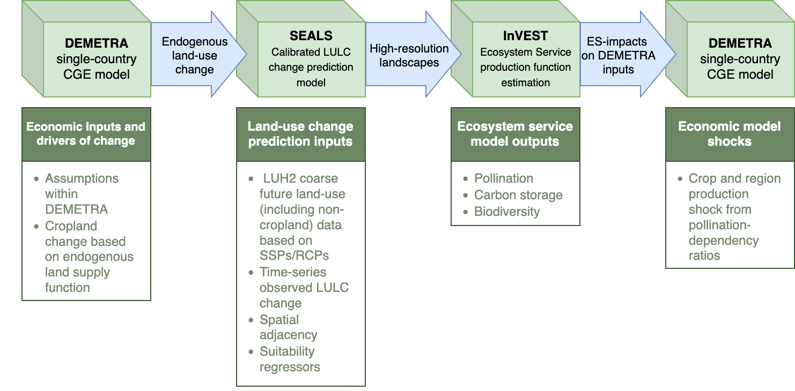

------------------------------------------------------------------------

## Installation

For complete details, see Justin Johnson's [installation guide](https://justinandrewjohnson.com/earth_economy_devstack/installation.html).

::: {.callout-note collapse="true"}
## Prerequisites

Before beginning, ensure you have:

-   **Git** - [Download here](https://git-scm.com/downloads)
-   **Miniforge3** (Python distribution) - [Download here](https://conda-forge.org/download/)
:::

::: {.callout-note collapse="true"}
## Basic Hazelbean Installation

Hazelbean is the core dependency for running SEALS. Install it with these commands:

``` bash
# Initialize conda (may not be needed depending on your shell configuration)
conda init

# Create a new environment (replace 'seals_env' with your preferred name)
conda create -n seals_env

# Activate the environment
conda activate seals_env

# Install Hazelbean
mamba install hazelbean
```

**Note:** The `mamba install hazelbean` command may take 5-10 minutes to complete.
:::

------------------------------------------------------------------------

### SEALS Repository Installation

::: {.callout-note collapse="true"}
## Step 1: Install C/C++ Compiler

**Windows Users - Choose One Option:**

-   **Option 1:** Download from [Visual Studio Build Tools](https://visualstudio.microsoft.com/visual-cpp-build-tools/) and select "Download Build Tools"

-   **Option 2:** Use winget command:

    ``` bash
    winget install Microsoft.VisualStudio.2022.BuildTools --force --override "--passive --wait --add Microsoft.VisualStudio.Workload.VCTools;includeRecommended"
    ```

-   **Option 3:** Run the `install.bat` file from the Earth Economy Devstack repository root (executes the winget command above)

**Mac/Linux Users:**

Most users will already have Xcode installed. If not:

``` bash
xcode-select --install
```

This installs Xcode Command Line Tools including gcc and clang compilers.
:::

::: {.callout-note collapse="true"}
## Step 2: Clone SEALS Repository

Clone the repository to your local machine:

``` bash
git clone https://github.com/jandrewjohnson/seals_dev
```

**Recommended location:** `C:/Users/<username>/Files/seals/seals_dev` (Windows) or `/Users/<username>/Files/seals/seals_dev` (Mac/Linux)
:::

::: {.callout-note collapse="true"}
## Step 3: Install as Editable Package

``` bash
# Activate your conda environment
conda activate seals_env

# Navigate to the cloned repository
cd C:/Users/<username>/Files/seals/seals_dev

# Install as editable package
pip install -e . --no-deps
```
:::

------------------------------------------------------------------------

## Data Setup

<!-- Access all required data from this [Google Drive folder](https://drive.google.com/drive/folders/1ljiapyN1J_1CHrhDxqJ8YgLDAU-3-RmH?usp=drive_link). -->

### File Organization Structure

SEALS uses a specific directory structure to locate data automatically:

#### Base Data (Global Shared Data)

SEALS automatically downloads base data on first run to:

```         
<home>/Files/base_data/seals/
<home>/Files/base_data/lulc/
```

<!-- **Additional InVEST data** (download from Google Drive): -->

#### Additional InVEST data

```         
<home>/Files/base_data/global_invest/
<home>/Files/base_data/crops/
```

#### Project Data (Country/Region-Specific)

<!-- Download from Google Drive and place in: -->

#### Additional country data

```         
<home>/Files/seals/projects/run_ken_demetra/
```

This includes:

-   Region border files (shapefiles and raster GeoTIFFs)
-   DEMETRA shock files (CSV)
-   Downscaling coefficient files (CSV and global rasters)
-   Scenario configuration files

------------------------------------------------------------------------

## Testing SEALS

### Standard Test Run

This basic test verifies your installation is working correctly.

**Steps:**

1.  Locate `run_seals_standard.py` in `seals_dev/seals/`

2.  Ensure your conda environment is activated:

    ``` bash
    conda activate seals_env
    ```

3.  Run the script:

    ``` bash
    python run_seals_standard.py
    ```

4.  Check for output in:

    ```         
    <home>/Files/seals/projects/standard_<timestamp>/intermediate/visualization/lulc_pngs/
    ```

**Expected Output:** You should see land-use/land-cover (LULC) maps like:

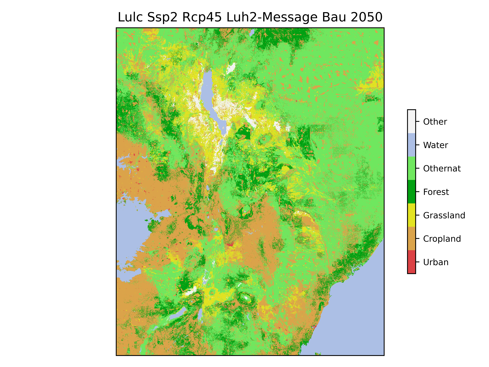

### Common Issues

*Problem*: `ValueError: Could not open...` error on first run

*Solution*: The base_data download likely didn't complete. Run the script again now that base_data is fully downloaded.

------------------------------------------------------------------------

## Kenya DEMETRA Scenario

This scenario demonstrates land-use change modeling for Kenya using DEMETRA economic shocks.

### Key Input Files

**Scripts:**

-   Main execution script: `run_ken_demetra.py`

**Data Files:**

| File | File Type | Location |
|--------------------------|----------------------|------------------------|
| Scenario Configuration | `ken_scenarios_full.csv` | `projects/run_ken_demetra/` |
| Default Downscaling Coefficients | CSV files + Global rasters | `base_data/seals/static_regressors` `base_data/seals/default_inputs` |
| DEMETRA Shocks | CSV files | `projects/run_ken_demetra/inputs/demetra_shocks` |
| Regional Borders | Shapefiles + Raster GeoTIFFs | `projects/run_ken_demetra/inputs/borders` |
| Project Downscaling Coefficients | CSV files + Global rasters | `projects/run_ken_demetra/inputs/static_regressors` `projects/run_ken_demetra/inputs/coefficients` |

**Note:** The structure is flexible, but ensure that the paths defined in the scenario CSV and coefficients CSV are properly defined.

### Running the Kenya Scenario

``` bash
conda activate seals_env
cd seals_dev/seals/
python run_ken_demetra.py
```

------------------------------------------------------------------------

## Understanding the Task Tree

When you run `run_ken_demetra.py`, SEALS creates a ProjectFlow object that executes a series of tasks in a hierarchical tree structure. Each task creates outputs in the `intermediate/` directory.

### Task Hierarchy

For reference, here's the complete task tree as shown in the console output:

```         
execute
├── project_aoi
├── fine_processed_inputs
│   ├── generated_kernels
│   ├── lulc_clip
│   ├── lulc_simplifications
│   ├── lulc_binaries
│   └── lulc_convolutions
├── coarse_change
│   ├── coarse_extraction
│   ├── coarse_simplified_proportion
│   ├── coarse_simplified_ha
│   └── coarse_simplified_ha_difference_from_previous_year
├── regional_change
├── allocations
│   └── allocation_zones
│       └── allocation
├── stitched_lulc_simplified_scenarios
├── visualization
│   └── lulc_pngs
├── reproject_lulc_rasters_to_equal_area
├── run_invest_carbon
├── run_invest_pollination
├── calculate_crop_value_and_shock
├── calculate_biodiversity_index
└── summarize_and_visualize_multi_vector
```

Each task is explained in detail below.

------------------------------------------------------------------------

## Task-by-Task Walkthrough

### 1. Project AOI (Area of Interest)

**Significance:** Defines the geographic boundary for the analysis and creates resolution pyramids for efficient processing at multiple scales.

**What it does:**

1.  Loads the area of interest boundary for Kenya from the input shapefile
2.  Creates a vector geopackage (`.gpkg`) file for the AOI
3.  Generates raster "pyramids" at different resolutions:
    -   Fine resolution: Matches the base LULC data (typically 300m)
    -   Coarse resolution: Matches the coarse projection data (typically 0.25°)

**Input files:**

-   Region shapefile from `projects/run_ken_demetra/inputs/borders`

**Output files:**

```         
intermediate/project_aoi/
├── aoi_KEN.gpkg                              # Vector boundary
└── pyramids/
    ├── aoi_ha_per_cell_coarse.tif           # Coarse resolution (hectares per cell)
    └── aoi_ha_per_cell_fine.tif             # Fine resolution (hectares per cell)
```

**Significance:**

-   The AOI defines the study region
    -   Can use default global country shapefile or project-specific
-   Pyramids allow multi-scale analysis
-   Fine resolution preserves local detail
-   Coarse resolution matches global projections

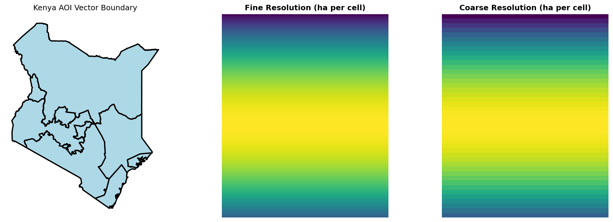

------------------------------------------------------------------------

### 2. Fine Processed Inputs

**Significance:** Prepares the baseline land-use/land-cover (LULC) data for allocation by simplifying classifications, creating binary masks, and generating spatial convolutions.

**What it does:**

1.  Generated Kernels: Creates Gaussian kernels for spatial smoothing
2.  LULC Clip: Clips global LULC data to the Kenya AOI
3.  LULC Simplifications: Reclassifies detailed ESA categories into 7 SEALS classes:
    -   Cropland
    -   Forest
    -   Grassland
    -   Urban
    -   Water
    -   Other natural (othernat)
    -   Other
4.  LULC Binaries: Creates separate binary masks for each class (1 = present, 0 = absent)
5.  LULC Convolutions: Applies Gaussian smoothing to capture neighborhood characteristics

**Key Output Structure:**

```         
intermediate/fine_processed_inputs/
├── generated_kernels/
│   ├── gaussian_1.tif                        # Small neighborhood kernel
│   └── gaussian_5.tif                        # Large neighborhood kernel
├── lulc/esa/
│   ├── lulc_esa_2020.tif                     # Original ESA LULC
│   └── seals7/
│       ├── lulc_esa_seals7_2020.tif          # Simplified 7-class LULC
│       ├── binaries/2020/                     # Binary masks by class
│       │   ├── binary_esa_seals7_2020_cropland.tif
│       │   ├── binary_esa_seals7_2020_forest.tif
│       │   └── ...
│       └── convolutions/2020/                 # Smoothed neighborhood data
│           ├── convolution_esa_seals7_2020_cropland_gaussian_1.tif
│           ├── convolution_esa_seals7_2020_cropland_gaussian_5.tif
│           └── ...
```

**Significance:**

-   Simplification reduces complexity while preserving key land-use patterns
-   Binary masks enable class-specific analysis
-   Convolutions capture spatial context
-   These features inform the allocation model's decision-making

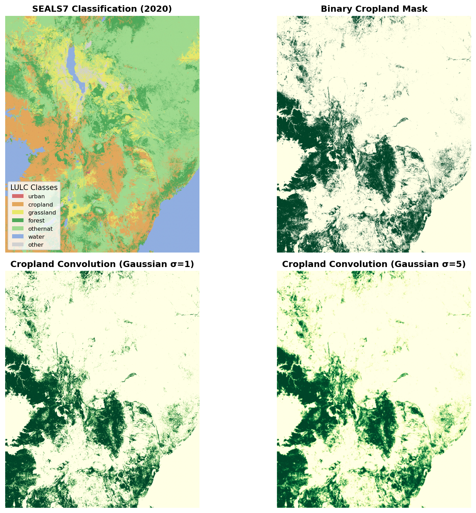

------------------------------------------------------------------------

### 3. Coarse Change

**Significance:** Extracts and processes land-use change projections from global coarse-resolution models (e.g., LUH2) for the Kenya region.

**What it does:**

1.  Coarse Extraction: Clips global projection data to Kenya's bounding box and selected year
2.  Coarse Simplified Proportion: Calculates proportions of each SEALS7 class
3.  Coarse Simplified Ha: Converts proportions to hectares
4.  Ha Difference: Calculates change in hectares between time periods (e.g., 2035 → 2050)

**Key Output Example:**

```         
intermediate/coarse_change/coarse_simplified_ha_difference_from_previous_year/
└── ssp2/rcp45/luh2-message/bau/2050/
    ├── cropland_2050_2035_ha_diff_ssp2_rcp45_luh2-message_bau.tif
    ├── forest_2050_2035_ha_diff_ssp2_rcp45_luh2-message_bau.tif
    └── ...
```

**Significance:**

-   Links exogenous global scenarios (SSP2, RCP4.5) to local allocation
-   Tracks changes over time (2035 baseline → 2050 projection)

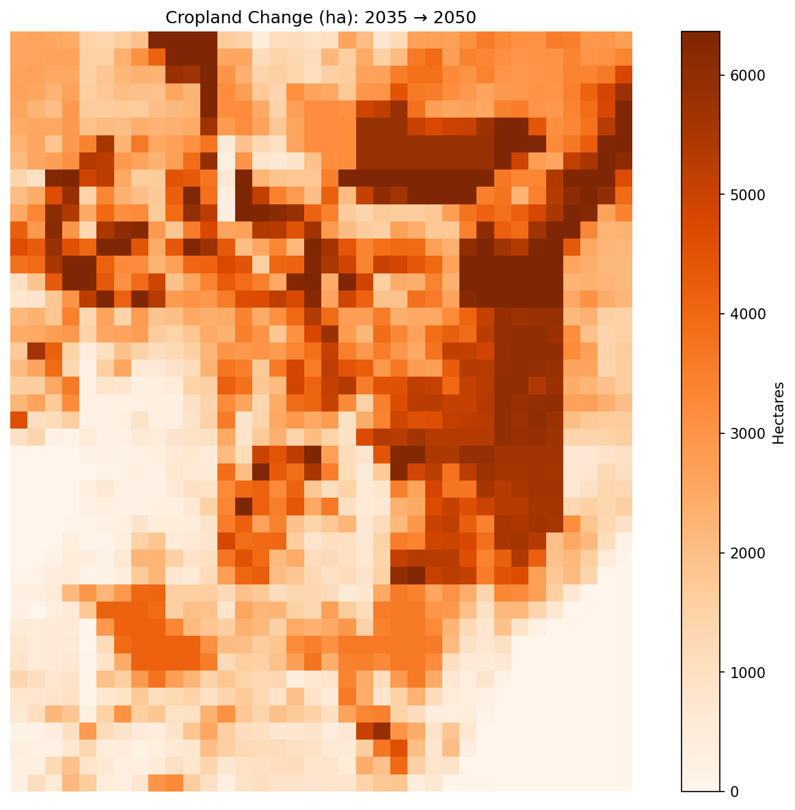

------------------------------------------------------------------------

### 4. Regional Change

**Significance:** Adjusts coarse-resolution changes using regional covariates to account for local constraints and opportunities.

**What it does:**

1.  Creates a region ID map dividing AOI into separately shocked zones
2.  Applies various algorithms (e.g., proportional, covariate sum shift) to downscale from regional to coarse

**Key Outputs:**

```         
intermediate/regional_change/
├── region_ids.tif                              # Regional zone identifiers
└── ssp2/rcp45/luh2-message/LP/2050/
    └── cropland_2050_2035_ha_diff_ssp2_rcp45_luh2-message_LP_covariate_sum_shift.tif
```

**Significance:**

-   Accounts for local factors (infrastructure, topography, current land use)
-   Bridges the gap between coarse change and regional change

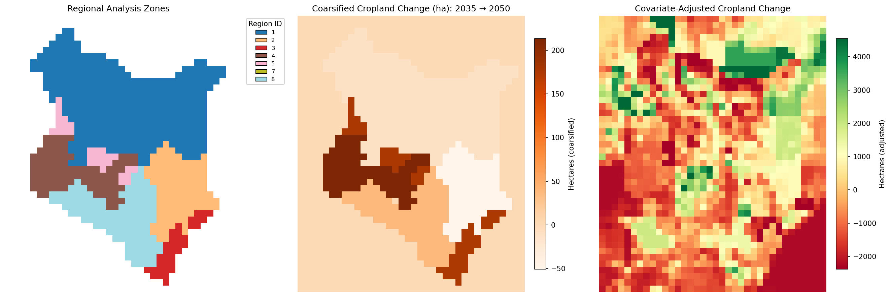

------------------------------------------------------------------------

### 5. Allocations

**Significance:** Performs the core SEALS allocation, distributing coarse-resolution changes to fine-resolution pixels based on suitability.

**What it does:**

1.  Divides Kenya into allocation zones (e.g., zone 213_84)
2.  For each zone, runs an allocation algorithm that:
    -   Considers spatial covariates (convolutions, distance, etc.)
    -   Respects constraints (protected areas, water bodies)
    -   Tracks cumulative change
3.  Produces new LULC maps for each scenario and year

**Key Output Structure:**

```         
intermediate/allocations/ssp2/rcp45/luh2-message/bau/2050/
└── allocation_zones/213_84/allocation/
    ├── block_ha_per_cell_coarse.tif              # Coarse resolution for this block
    ├── cumulative_change_happened.tif            # Tracking allocated changes
    └── lulc_esa_seals7_ssp2_rcp45_luh2-message_bau_2050.tif  # New LULC
```

**Significance:**

-   This is the core of SEALS, where changes actually get placed on the landscape
-   Allocation uses machine learning and optimization to find the "best" locations
-   Results are spatially explicit: you can see exactly where cropland expanded

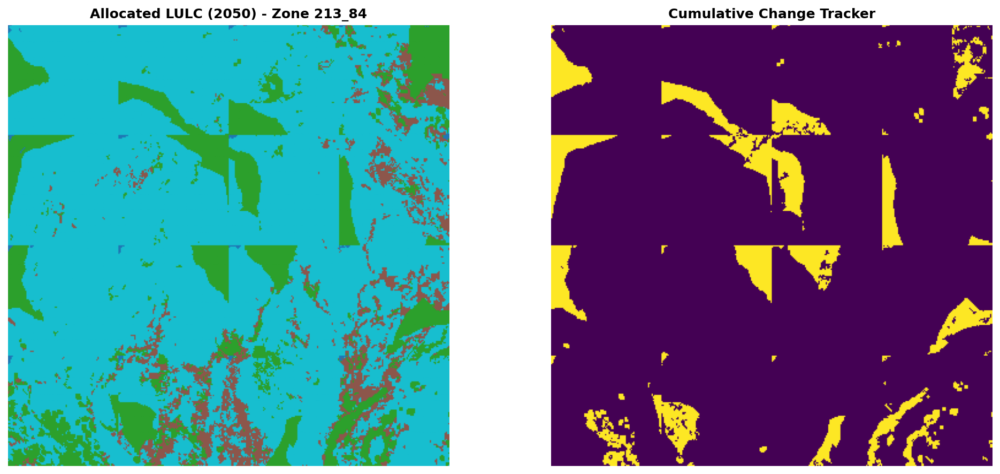

------------------------------------------------------------------------

### 6. Stitched LULC Scenarios

**Significance:** Combines all allocation zones back into complete Kenya-wide LULC maps for each scenario.

**What it does:**

1.  Stitches together individual allocation blocks
2.  Clips to exact Kenya boundary
3.  Generates outputs for all scenario combinations (bau, enablers, es_index, LP, FP, LP+FP)

**Key Outputs:**

```         
intermediate/stitched_lulc_simplified_scenarios/
├── lulc_esa_seals7_ssp2_rcp45_luh2-message_bau_2050.tif
├── lulc_esa_seals7_ssp2_rcp45_luh2-message_LP_2050.tif
├── lulc_esa_seals7_ssp2_rcp45_luh2-message_FP_2050.tif
├── lulc_esa_seals7_ssp2_rcp45_luh2-message_LP+FP_2050.tif
└── lulc_esa_seals7_ssp2_rcp45_luh2-message_LP+FP_2050_clipped.tif
```

**Significance:**

-   Provides complete LULC projections
-   Enables comparison across scenarios
-   Serves as input to ecosystem service models (InVEST)

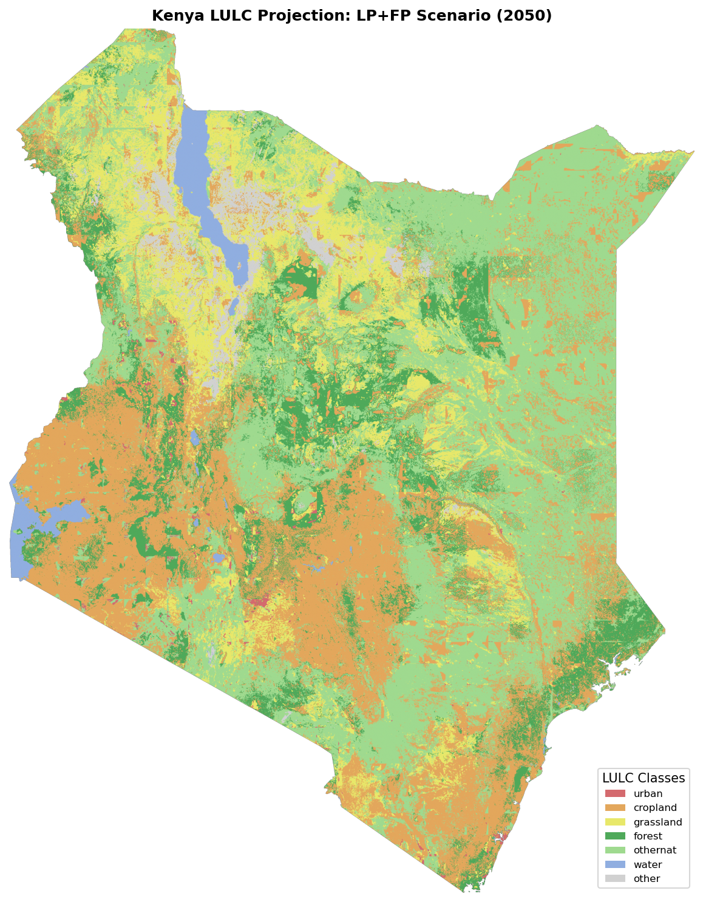

------------------------------------------------------------------------

### 7. Visualization

**Significance:** Creates publication-quality PNG images of LULC projections for easy viewing and sharing.

**What it does:**

1.  Renders each stitched LULC raster as a PNG
2.  Applies consistent color schemes
3.  Adds appropriate labels and legends

**Key Outputs:**

```         
intermediate/visualization/lulc_pngs/
├── lulc_esa_seals7_ssp2_rcp45_luh2-message_bau_2050.png
├── lulc_esa_seals7_ssp2_rcp45_luh2-message_LP_2050.png
└── lulc_esa_seals7_ssp2_rcp45_luh2-message_LP+FP_2050.png
```

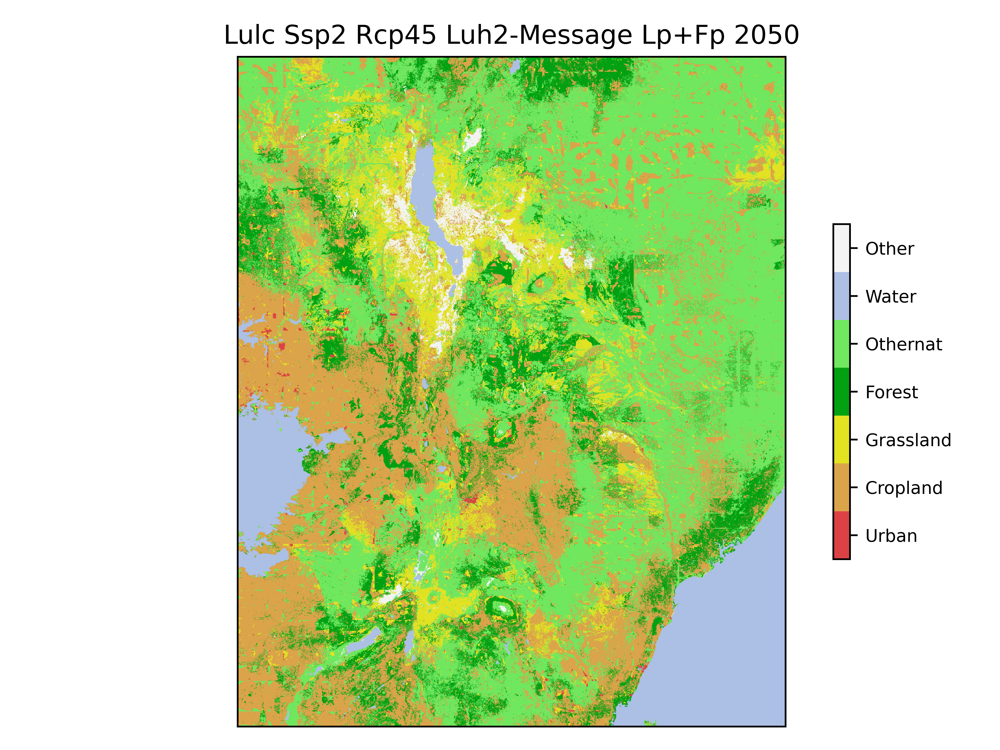

------------------------------------------------------------------------

### 8. InVEST Modules

**Significance:** Calculates ecosystem service values using Natural Capital Project's InVEST models.

#### 8.1 Reproject to Equal Area

Converts LULC maps to equal-area projection (required for accurate area-based calculations).

```         
intermediate/reproject_lulc_rasters_to_equal_area/
└── lulc_esa_seals7_ssp2_rcp45_luh2-message_LP+FP_2050.tif
```

#### 8.2 Carbon Storage

Estimates above- and below-ground carbon stocks using the InVEST Carbon model.

**Key Output:**

```         
intermediate/run_invest_carbon/
└── esa_seals7_ssp2_rcp45_luh2-message_LP+FP_2050/
    └── c_storage_bas.tif                        # Carbon storage (Mg C/ha)
```

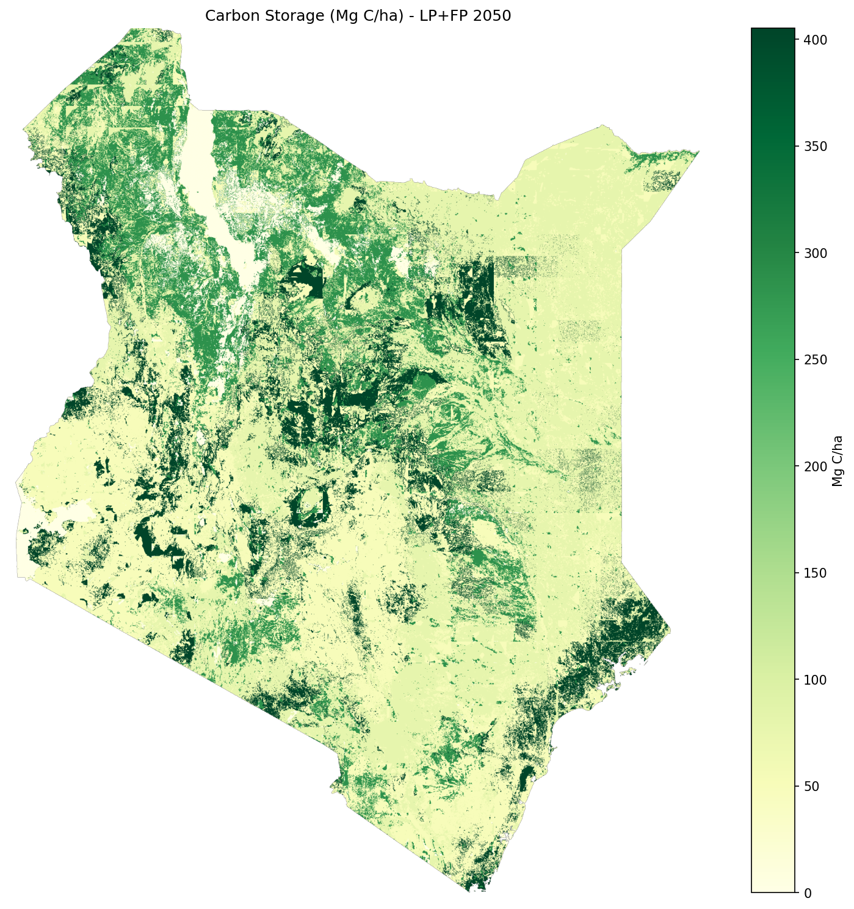

#### 8.3 Pollination

Models pollinator abundance and crop pollination dependency using InVEST's Pollination model.

**Key Output:**

```         
intermediate/run_invest_pollination/
└── esa_seals7_ssp2_rcp45_luh2-message_LP+FP_2050/
    └── total_pollinator_abundance_summer.tif    # Pollinator index
```

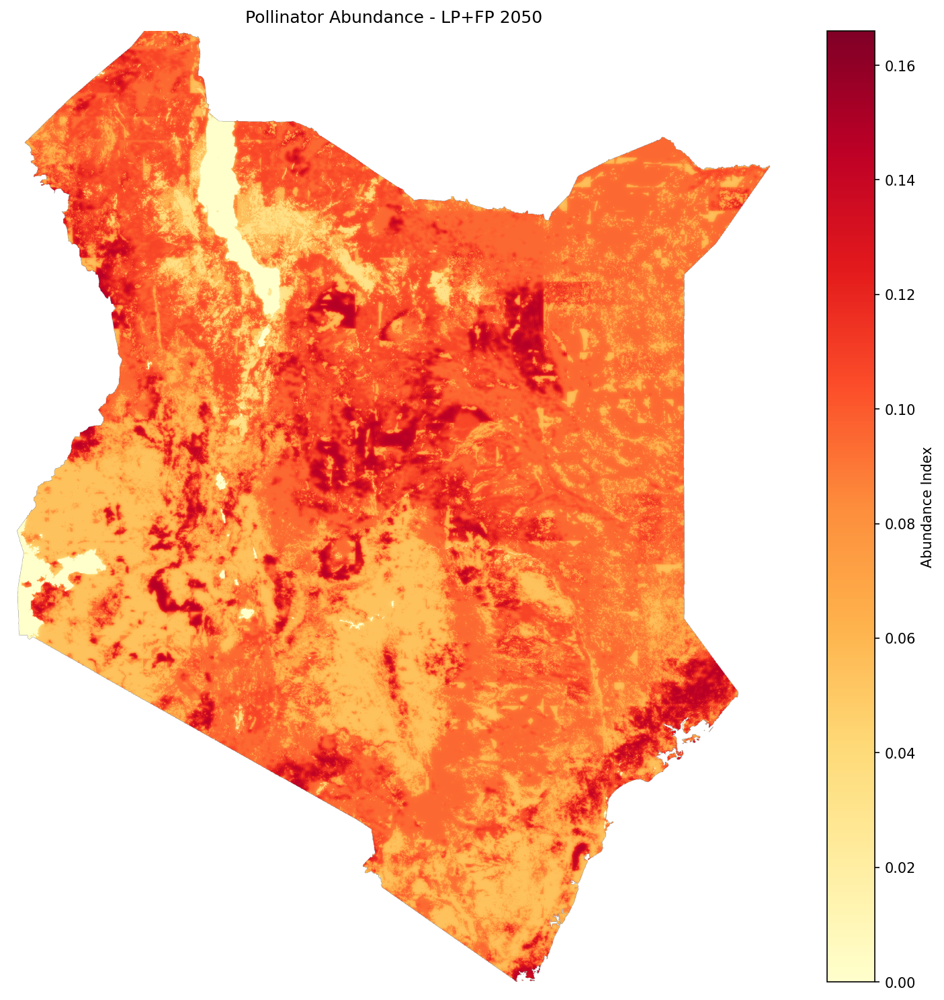

#### 8.4 Crop Value and Pollination Shocks

Calculates agricultural value and applies DEMETRA economic shocks based on pollination changes.

**What it does:**

1.  Baseline crop value: Combines production data from all crops weighted by pollination dependency
2.  Maximum potential loss: Calculates loss if pollination disappeared completely
3.  Pollination sufficiency threshold: Uses 0.3 as the critical threshold
4.  Adjusted crop value: For each scenario:
    -   If below threshold → apply proportional loss
    -   If at or above threshold → maintain baseline value
5.  Regional shocks: Calculates `shock_value = scenario_value / baseline_value` by region

````{=html}
<!-- **The key formula:**
```python
if poll_suff < 0.3:
    adjusted_value = baseline - max_loss * (1 - (1/0.3) * poll_suff)
else:
    adjusted_value = baseline
``` -->
````

**Key Outputs:**

```         
intermediate/calculate_crop_value_and_shock/
├── crop_value_baseline.tif                      # Baseline crop value ($/ha)
├── crop_value_max_lost.tif                      # Maximum possible loss ($/ha)
├── crop_value_adjusted_baseline_2020.tif        # Adjusted baseline
├── crop_value_adjusted_esa_seals7_ssp2_rcp45_luh2-message_LP+FP_2050.tif  # Scenario
├── pollination_shocks_seals7_ssp2_rcp45_luh2-message.csv         # Regional shock values
└── pollination_shocks_alt_seals7_ssp2_rcp45_luh2-message.csv     # Alternative regions
```

**Significance:**

-   Translates ecological changes (pollination) into economic impacts
-   Provides spatially explicit economic loss estimates
-   Generates shock values for DEMETRA CGE model integration

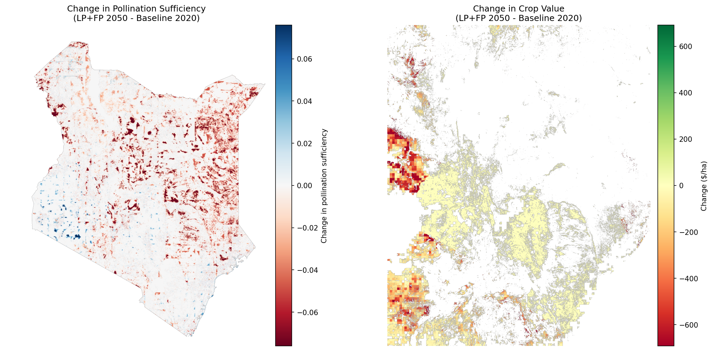



#### 8.5 Biodiversity Index

Calculates habitat quality and biodiversity index based on LULC patterns and biodiversity data (species ranges, endemic species ranges, key biodiversity areas, ecoregions). Not currently an official part of the InVEST ecosystem.

**Key Output:**

```         
intermediate/calculate_biodiversity_index/
└── esa_seals7_ssp2_rcp45_luh2-message_LP+FP_2050/
    └── esa_seals7_ssp2_rcp45_luh2-message_LP+FP_2050_index.tif
```

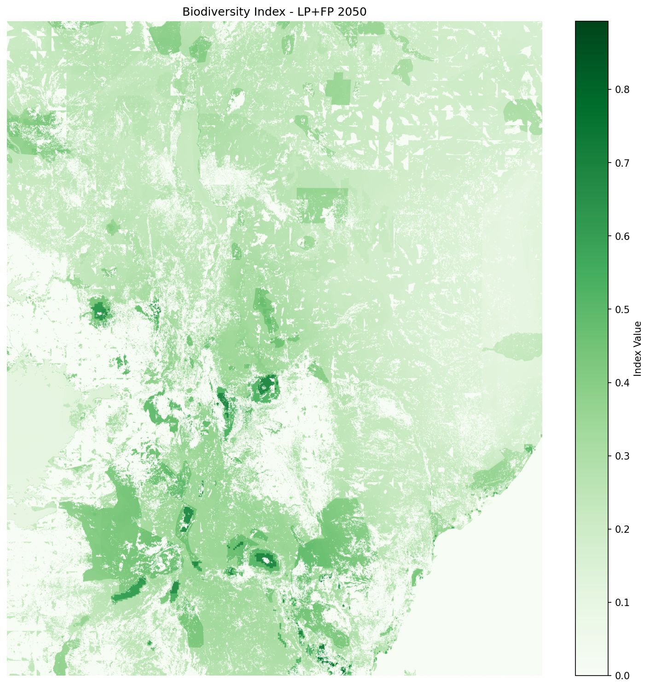

------------------------------------------------------------------------

### 9. Summary and Visualization

**Significance:** Creates multi-panel comparison figures showing results across all scenarios and ecosystem services.

**What it does:**

1.  Compiles results from all InVEST modules
2.  Generates comparison figures across scenarios (bau, LP, FP, LP+FP, enablers, es_index)
3.  Creates summary visualizations for reports and presentations

**Key Outputs:**

```         
intermediate/summarize_and_visualize_multi_vector/
├── biodiversity_combined/
│   └── esa_seals7_ssp2_rcp45_luh2-message_bau_biodiversity_combined.png
├── carbon_combined/
│   └── esa_seals7_ssp2_rcp45_luh2-message_es_index_carbon_combined.png
├── lulc_combined/
│   └── esa_seals7_ssp2_rcp45_luh2-message_enablers_lulc_combined.png
├── pollination_combined/
│   └── esa_seals7_ssp2_rcp45_luh2-message_es_index_pollination_combined.png
└── summary_visualizations/
    └── summary_grouped_vertical_2050.png        # Master summary figure
```

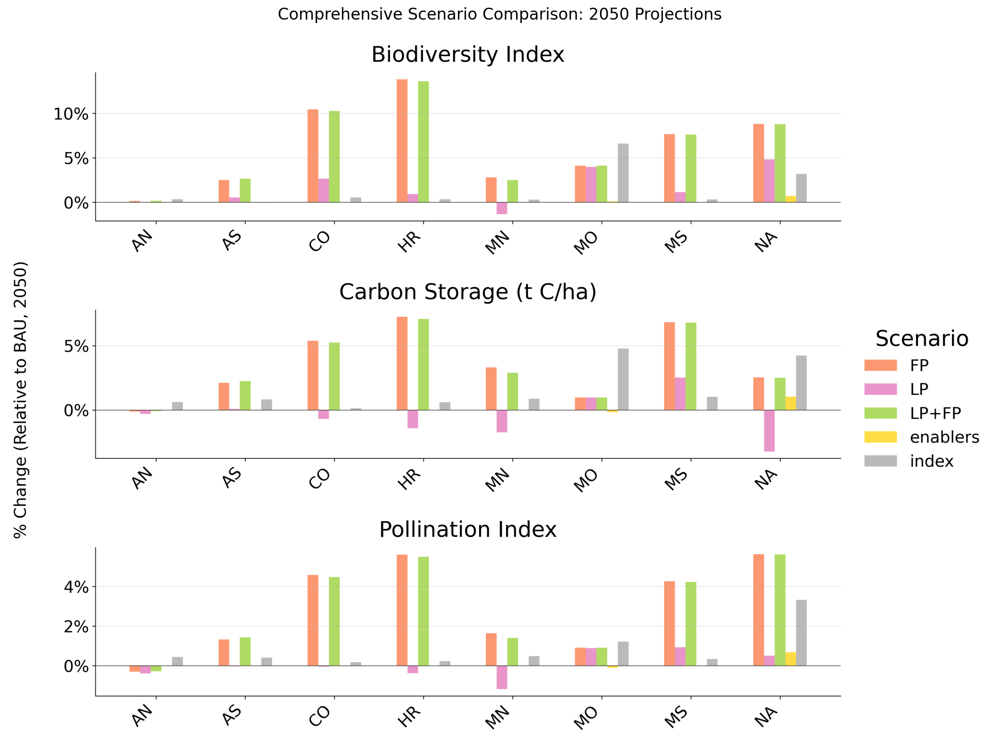

------------------------------------------------------------------------

## Final Outputs

Output files will be generated in:

```         
<home>/Files/seals/projects/run_ken_demetra/
```

**Primary outputs include:**

**SEALS outputs:**

-   LULC geotiff files: `intermediate/stitched_lulc_simplified_scenarios/`
    -   Land-use/land-cover predictions for each scenario year
-   LULC png files: `intermediate/visualization/lulc_pngs/`
    -   Spatial representation of land-use transitions

**Project outputs:**

-   Figures: `intermediate/summarize_and_visualize_multi_vector/`
    -   `biodiversity_combined`
    -   `carbon_combined`
    -   `carbon_total_combined`
    -   `lulc_combined`
    -   `pollination_combined`
    -   `summary_visualizations`

------------------------------------------------------------------------

## Additional Resources

-   SEALS Repository: <https://github.com/jandrewjohnson/seals_dev>
-   InVEST Documentation: <https://naturalcapitalproject.stanford.edu/software/invest>
-   InVEST Python Documentation: <https://invest.readthedocs.io/en/latest/index.html>